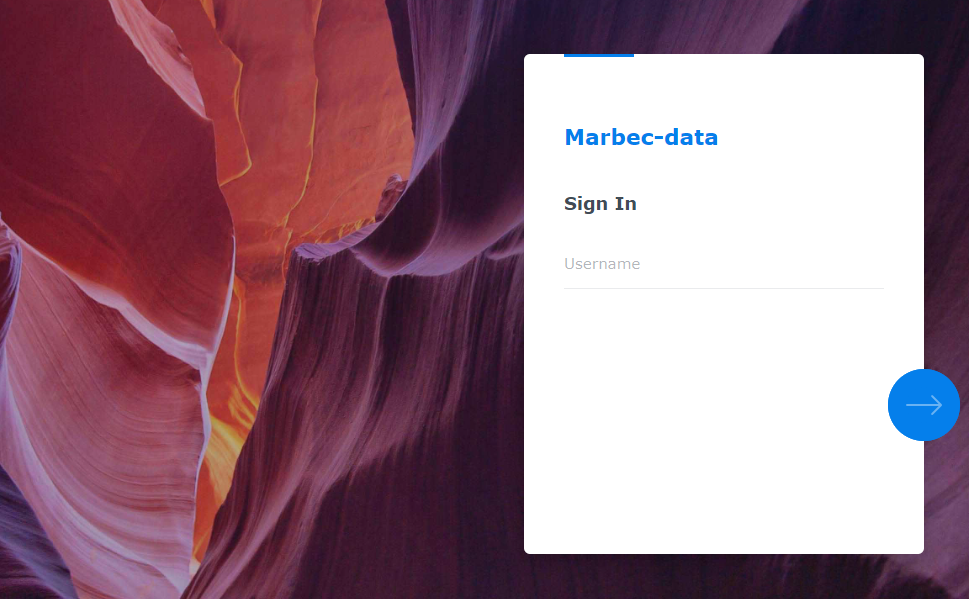
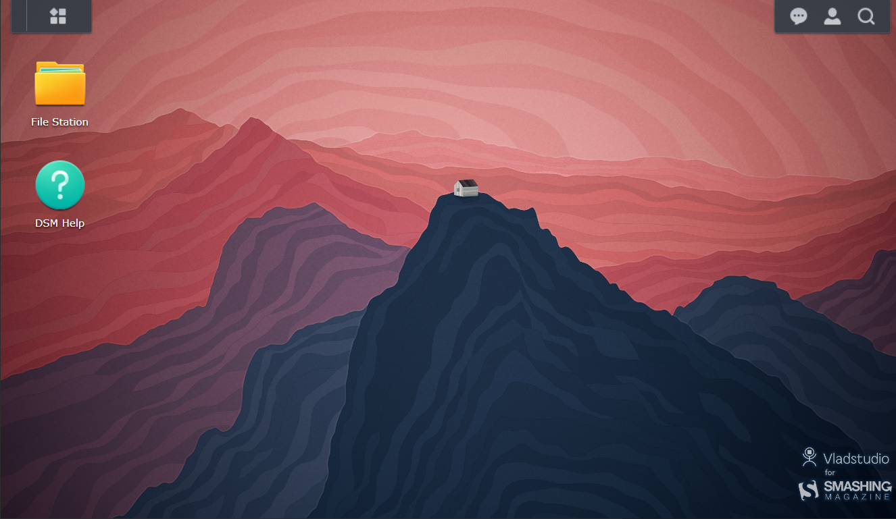
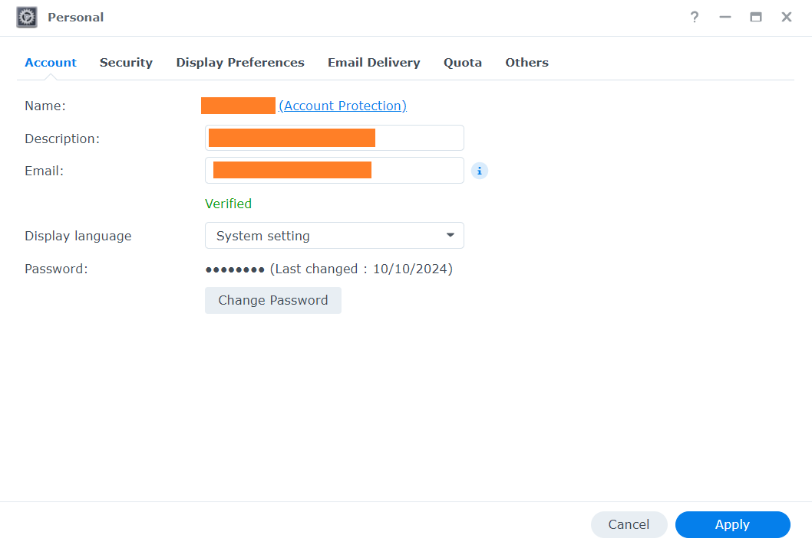
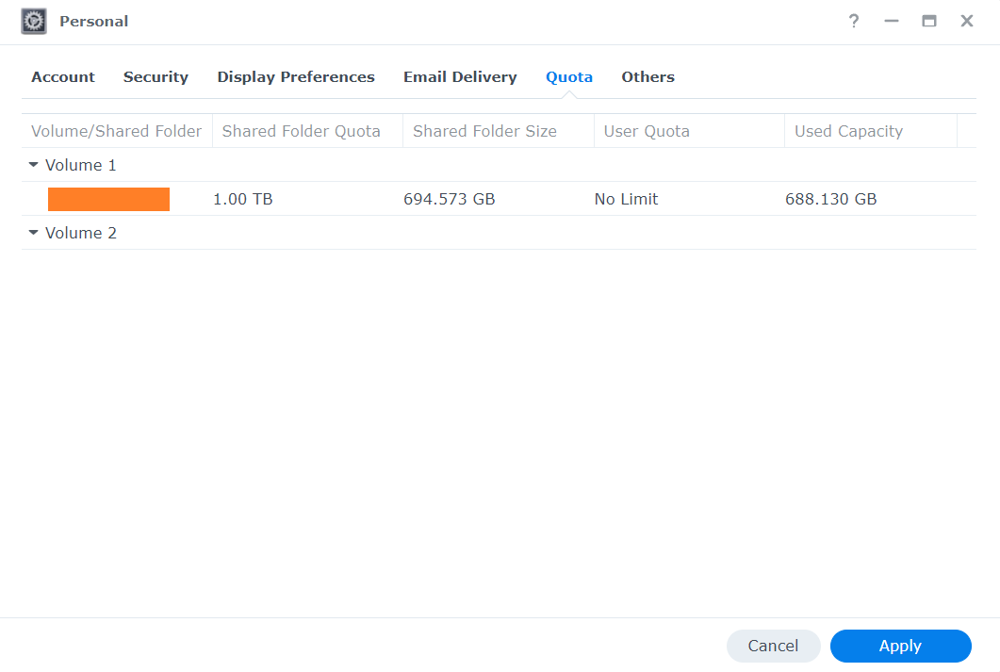
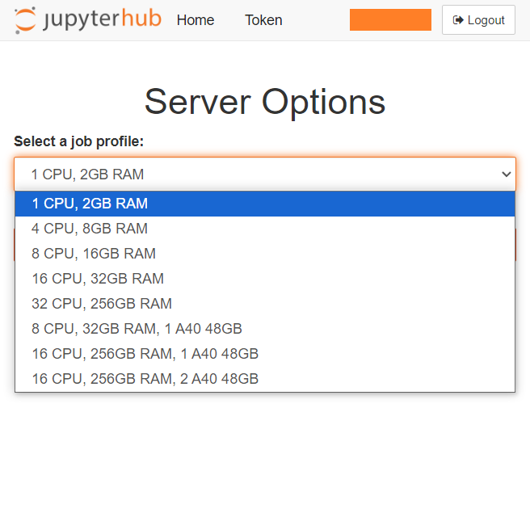
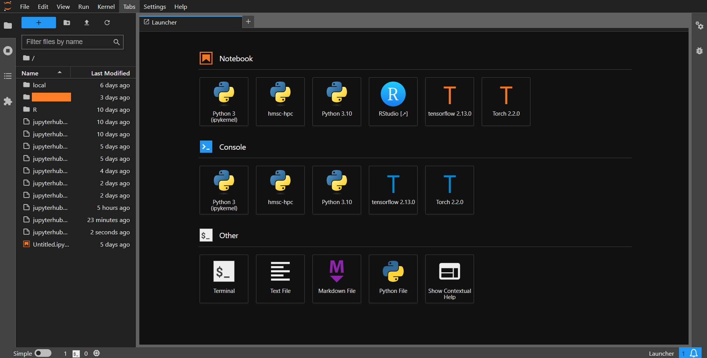
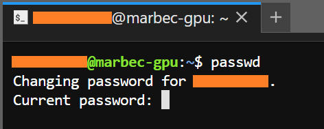

Image credits: Diego Fernandez at [Unplash](https://unsplash.com/photos/mixing-console-yRNJAcdpDAo?utm_content=creditShareLink&utm_medium=referral&utm_source=unsplash)

# [FR] Introduction à `marbec-data` et `marbec-gpu`

## Comment accéder à `marbec-data` ?

Cela dépendra de ce que nous devons faire. Si nous voulons simplement jeter un coup d'œil rapide aux fichiers et vérifier certains aspects de notre compte, il suffira d'ouvrir une fenêtre de navigateur et d'aller à l'adresse <https://marbec-data.ird.fr/>. Une interface de connexion s'affichera où nous devrons entrer nos identifiants d'accès (fournis par les administrateurs de `marbec-gpu`).

Une fois connectés, nous verrons une interface semblable à un bureau affichant quelques icônes d'accès à nos répertoires partagés et à la documentation générale d'utilisation de la plateforme.

## Comment changer notre mot de passe de `marbec-data` ?

Nous commencerons par cliquer sur l'icône des options utilisateur (celle représentant une petite personne en haut à droite), puis nous sélectionnerons l'option **Personnel**.

Une petite fenêtre s'ouvrira et, dans l'onglet affiché par défaut (**Compte**), nous aurons accès à l'option permettant de changer notre mot de passe (**Changer le mot de passe**). De plus, dans l'onglet **Préférences d'affichage**, nous pourrons modifier certains aspects tels que la langue de l'interface, l'image du bureau et les couleurs.

## Vérifier l'espace disponible sur `marbec-data`

Dans la même fenêtre **Personnel** mentionnée dans la section précédente, sous l'onglet **Quota**, nous pouvons vérifier la limite de stockage attribuée à notre utilisateur ainsi que l'espace utilisé jusqu'à présent dans chacun des dossiers associés à notre compte. C'est une manière simple et graphique de visualiser l'espace disponible restant. Si, à un moment donné, nous avons besoin de plus d'espace, il suffit d'en faire la demande par e-mail aux administrateurs de `marbec-data`.

::: callout-important
Si, au cours de l'exécution d'un processus, la limite de quota allouée est atteinte, le système bloquera toute tentative d'enregistrement de fichiers, ce qui entraînera soit l'arrêt inattendu du processus, soit des erreurs liées à des problèmes d'écriture sur le disque.
:::

## Comment gérer des fichiers dans `marbec-data` ou entre `marbec-data` et notre PC ?

Nous avons un [article](https://luislaum.github.io/blog/marbec-data-manage-files/marbec-data-manage-files.html) où nous développons ce point plus en détail.

## Comment accéder à `marbec-gpu` ?

Le moyen le plus simple d'accéder à `marbec-gpu` est via un navigateur en utilisant l'environnement JupyterLab. Pour cela, il suffit d'ouvrir une fenêtre de navigateur (Chrome, Firefox, Brave, etc.) et de se rendre à l'adresse <https://marbec-gpu.ird.fr/>. Une fenêtre s'affichera pour entrer nos identifiants (**ATTENTION : Ce ne sont pas nécessairement les mêmes que ceux de `marbec-data`**) puis nous cliquerons sur le bouton **Start my server**. Ensuite, un menu déroulant nous permettra de choisir parmi différentes configurations prédéfinies de puissance de calcul pour notre session.

::: callout-note
Bien que nous ayons mentionné que `marbec-gpu` dispose d'un grand nombre de CPU, GPU et de RAM, cela représente 100 % de sa puissance absolue, et `marbec-gpu` est un service partagé. Il n'est donc pas possible (ni autorisé) qu'un seul utilisateur monopolise la totalité de sa capacité. C'est pourquoi la première étape consiste à choisir la puissance requise pour notre processus. Par exemple, si nous voulons exécuter un processus d'automatisation de téléchargement de données satellitaires, réserver 1 CPU et 2 Go de RAM suffira. En revanche, si notre script est conçu (et testé) pour n'utiliser que des cœurs CPU, il n'est pas nécessaire de réserver des configurations incluant des GPU. Rappelons que si nous sélectionnons une option trop puissante que nous n'utiliserons pas pleinement, elle ne sera pas disponible pour un autre utilisateur qui pourrait en avoir réellement besoin (choisissez judicieusement).
:::

Après avoir sélectionné (et réservé) les ressources pour notre session et cliqué sur **Start**, une fenêtre s'ouvrira avec le Launcher de JupyterLab. Nous y verrons les différentes applications préinstallées et disponibles. La principale est **Terminal**, qui nous permettra de lancer (exécuter) nos processus (scripts).

## Changer son mot de passe sur `marbec-gpu`

À partir de l'étape précédente, nous commencerons par ouvrir une fenêtre de **Terminal** (en cliquant sur l'icône correspondante). Dans la fenêtre qui s'ouvre, nous taperons la commande `passwd` (puis *Enter*). Ensuite, il nous sera demandé de saisir notre mot de passe actuel, puis le nouveau. **ATTENTION : Par défaut et pour des raisons de sécurité, lors du changement de mot de passe, aucun curseur ne s'affiche à l'écran pendant la saisie. Il pourrait donc sembler que le clavier ne fonctionne pas, mais ce n'est pas le cas. Tapez normalement.**

::: callout-important
Il est très important de définir des mots de passe sécurisés (alphanumériques avec des symboles et une combinaison de majuscules et de minuscules), de préférence différents pour la connexion à `marbec-data` et `marbec-gpu`. Par ailleurs, l'environnement JupyterLab PERMET l'utilisation des raccourcis classiques comme `Ctrl+C`-`Ctrl+V` (ou `Cmd+C`-`Cmd+V` sur MacOS) pour copier-coller des chaînes de caractères, ce qui peut être utilisé lors du changement de mot de passe avec la commande `passwd`.
:::

## Comment exécuter un processus sur `marbec-gpu` ?

Nous avons un [article](https://luislaum.github.io/blog/marbec-gpu-run-process/marbec-gpu-run-process.html) où nous développons ce point plus en détail.

---

# [EN] Introduction to `marbec-data` and `marbec-gpu`

## What are they? Are they the same?

No. `marbec-data` and `marbec-gpu` compose a *High-performance computing system*. (Very) Basically, it is like having a supercomputer prepared to deal with complex problems. Imagine that, instead of having a single processor (Intel/AMD) working in conjunction with the RAM and storage space of just your computer (e.g. your laptop), you have several computers linked together combining their power to run complex processes. This is how HPC works: it uses multiple computers working together to solve very large computations much faster than a single personal computer could. Marbec HPC is composed of two systems: `marbec-data` (a Network File System or NFS) and `marbec-gpu` (a compute cluster).

**An NFS** is a network protocol that allows multiple devices connected to a network to share files and directories. This allows researchers to store input data, codes and results, but with the advantage of having a centralized backup and the ability to access their files from any machine connected to the cluster. In very simple words and going back to the analogy with your current PC, `marbec-data` takes the place of the storage (i.e. the hard disk) in the HPC. On the other hand, a **compute cluster** is, in essence, a set of interconnected computational elements working in a coordinated manner to execute complex computational processes. Within the analogy of your current PC, `marbec-gpu` equates to: your main processor (CPU), your graphics processor (GPU), general RAM and video RAM. Of course, with these simplifications we are leaving out some important details that we will explain in depth as we need to.

## Power of `marbec-gpu`

Up to October 2024, `marbec-gpu` has:

* CPU: 4 x [Intel(R) Xeon(R) Platinum 8380 @2.30GHz, 40 physical cores, 80 logical cores]
* RAM: 1.5 TB DDR4
* GPU: 2 x [NVIDIA A40, 48 GB ECC GDDR6 RAM, 10'752 CUDA cores, 336 tensor cores, 696 GB/s bandwidth]

## How to access marbec-data?

This will depend on what we need to do. If we just want to take a quick look at the files and review aspects of our account, we just open a browser window and go to the address <https://marbec-data.ird.fr/>. This will open a login interface where we just need to enter our credentials (provided by the `marbec-gpu` administrators).

Once inside, we will see a sort of desktop where we will see a couple of icons to access our shared directories and general documentation on the use of the platform.

## ¿How to change our password in `marbec-data`?

We will start by clicking on the user options icon (the one that looks like a little person) at the top right of the desktop and selecting the **Personal** option.

A small window will open where in the first tab shown (**Account**), we will have access to **Change password** option. Likewise, in the **Display Preferences** tab, we will be able to change aspects such as the interface language or the desktop image and colors. 

## Check our available space in `marbec-data`.

From the same **Personal** window seen in the previous section, in the **Quota** tab we will be able to verify the storage limit assigned to our user and what has been used so far in each of the folders associated to our user. This is a simple and graphic way to visualize the available space we have left. If at any time we need more space, just request it by e-mail to the `marbec-data` administrators.

::: callout-important
If at any time during the execution of a process the allocated quota limit is reached, the system will block any attempt to save files and this will result in the unplanned termination of the process or errors related to disk write problems.
:::

## How to manage files inside `marbec-data` or between `marbec-data` and our PC?

We have a [post](https://luislaum.github.io/blog/marbec-data-manage-files/marbec-data-manage-files.html) where we develop this point in more detail.

## How to access `marbec-gpu`?

The easiest way to access `marbec-gpu` is through a browser using the JupyterLab environment. To do this, just open a browser (Chrome, Firefox, Brave, etc.) window and go to <https://marbec-gpu.ird.fr/>. A window will appear to enter our credentials (NOTE: They are not necessarily the same as those of `marbec-data`) and then click on the **Start my server** button. Next, a drop-down menu will appear where we will be able to choose different default configurations of computing power for our session. 

::: callout-note
Although we indicated a moment ago that marbec-gpu has a good amount of CPUs, GPUs and RAM, this represents 100% of its absolute power and `marbec-gpu` is a shared service, so it is not possible (allowed) for a single user to monopolize 100% of its capacity. That is why the first choice will consist of deciding what is the power we require for our process. For example, if we want to run an automated process of downloading satellite information, it will be enough to reserve 1 CPU and 2GB of RAM. On the other hand, if our script is only configured (and tested) to use CPU cores, it will not be necessary to reserve those configurations that include GPU. Remember that if you select a very powerful option that you will not take advantage of, it will not be available for someone else who might really need it (choose wisely).
:::

After selecting (and reserving) the resources for our session and clicking **Start**, a window with the JupyterLab Launcher will appear. In it, we will be able to see the different preinstalled and available applications. The main one will be the **Terminal**, which is the one we will use to launch (execute) our processes (scripts).

## Change password in `marbec-gpu`.

From the previous step, we will start by opening a **Terminal** window (by clicking on the corresponding icon) and the window that opens we will type the command `passwd` (and then *Enter*). Next, we will be prompted to type our current and new passwords. **By default and for security, during the password change process NO cursor is displayed while typing, so it may appear that our keyboard is not working, but this is not the case. You type normally**.

::: callout-important
It is very important to define strong passwords (alphanumeric with symbols and uppercase-case) and preferably different passwords for the login in `marbec-data` and `marbec-gpu`. On the other hand, the JupyterLab environment DOES allow the use of classic shortcuts like `Ctrl+C`-`Ctrl+V` (or `Cmd+C`-`Cmd+V` in MacOS) to copy-paste character strings, so it is possible to use them during the password change process with the `passwd` command.
:::

## How to run a process on `marbec-gpu`?

We have a [post](https://luislaum.github.io/blog/marbec-gpu-run-process/marbec-gpu-run-process.html) where we develop this point in more detail.

