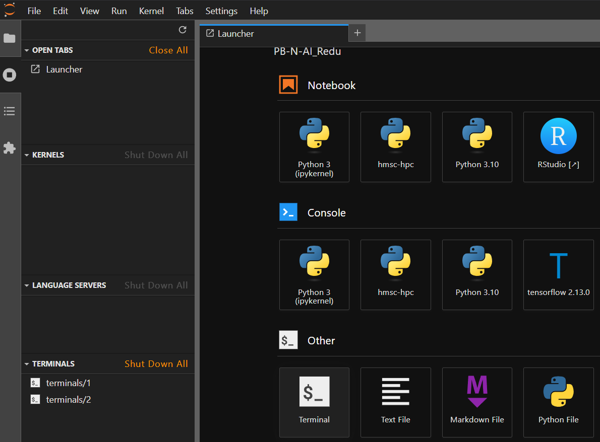
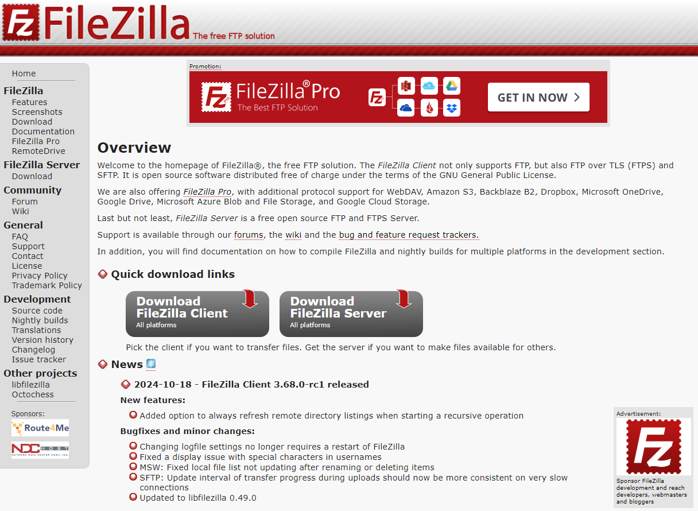
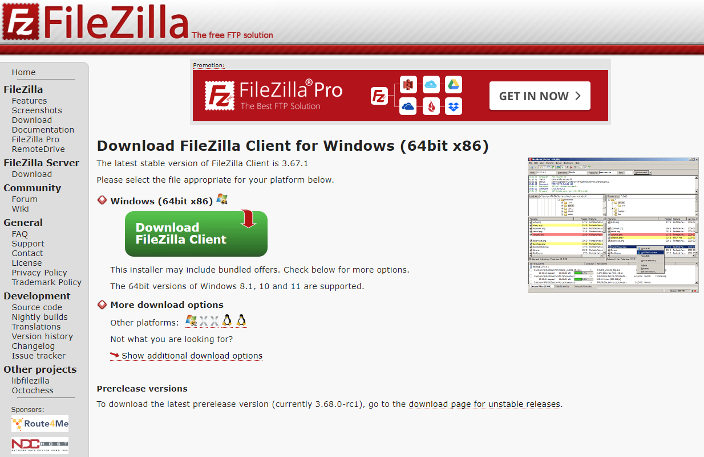
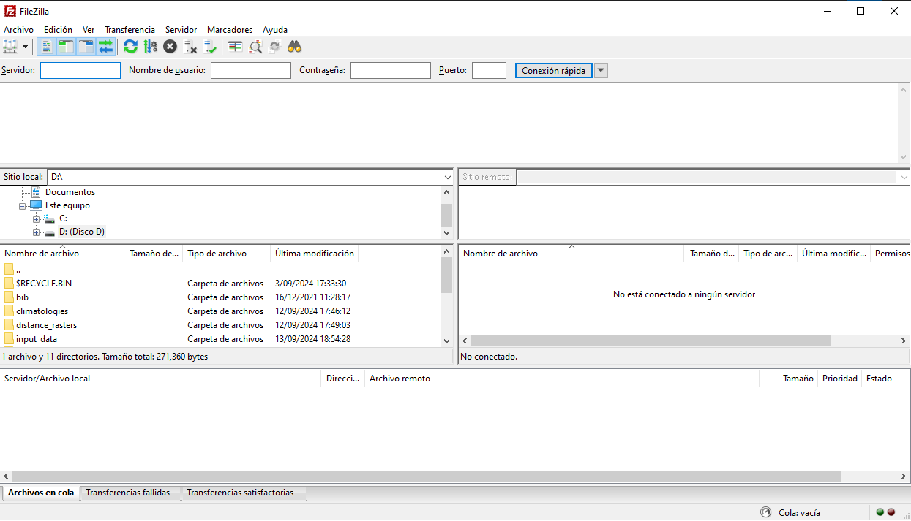
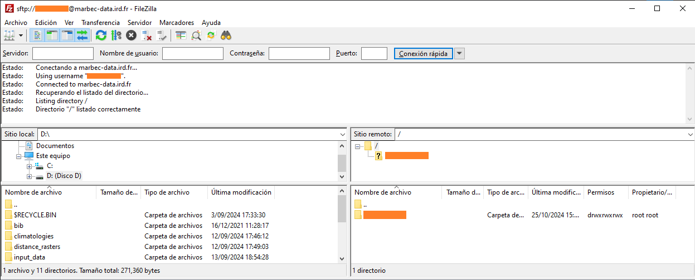
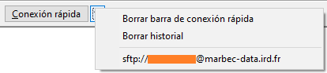
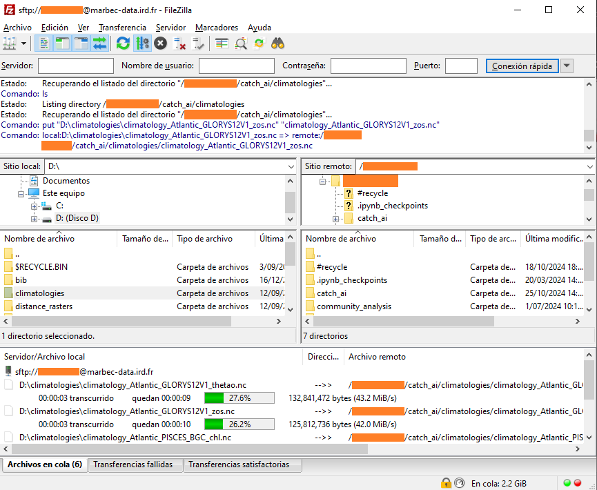
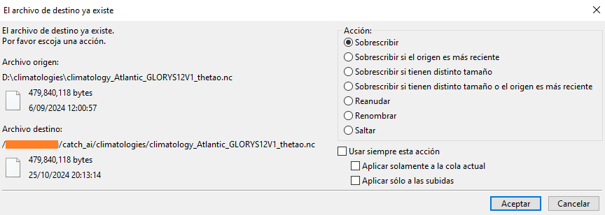

Image credits: Declan Sun at [Unplash](https://unsplash.com/photos/a-shelf-filled-with-lots-of-white-boxes-8byGIDpCU1w?utm_content=creditShareLink&utm_medium=referral&utm_source=unsplash)

# [FR] Gestion des fichiers depuis/vers Marbec-DATA

## Créer un dossier sur Marbec-DATA

* Aller sur l'interface web de JupyterLab et ouvrir une fenêtre Terminal.



* Créez le dossier de notre projet à l'aide de la commande `mkdir` :

```bash
mkdir /marbec-data/My_1st_peoject
```

## Lier un dossier de travail à Marbec-GPU.

Le serveur Marbec-DATA est dédié au stockage des données et est connecté au serveur Marbec-GPU, qui est utilisé pour les calculs. Cependant, ces dossiers n'apparaissent pas directement dans l'arbre des fichiers, donc pour les voir et y avoir accès dans un terminal JupyterLab, nous devons créer un **lien symbolique** :

* Ouvrez un terminal dans JupyterHub.

* Naviguez jusqu'à l'endroit où vous voulez que le dossier apparaisse :

```bash
cd /home/your_username/
```

* Créez le lien symbolique avec le nom de votre dossier dans Marbec-DATA :

```bash
ln -s /marbec-data/your_folder
```

* Rafraîchissez l'interface Jupyter pour voir le dossier apparaître.

## Gérer des fichiers entre Marbec-DATA et notre PC (FileZilla)

### Installer FileZilla et se connecter à Marbec-DATA

Le moyen le plus simple de déplacer (copier, couper et coller) des fichiers entre notre PC et l'un de nos dossiers de travail partagés ou notre dossier utilisateur sur Marbec-GPU est d'utiliser le logiciel gratuit FileZilla. Pour télécharger l'installateur, il suffit de se rendre sur son site officiel <https://filezilla-project.org/> et de cliquer sur le bouton **Download FileZilla Client**.



Par défaut, le site proposera de télécharger la version correspondant au système d'exploitation (OS) utilisé par notre navigateur, mais nous pouvons toujours choisir la version la plus adaptée dans la section *More download options*.



::: {.callout-caution title="Systèmes d'exploitation et architectures processeur"}
Ces dernières années, les processeurs à architecture ARM ont gagné en popularité sur le marché des PC. L'exemple le plus connu est la série Mx d'Apple (par ex. M1), mais récemment, des ordinateurs portables équipés de processeurs ARM (comme Snapdragon) ont également vu le jour. Un logiciel compilé pour une architecture ARM ne fonctionnera pas sur une architecture x86 (utilisée par Intel ou AMD) et inversement. Il est donc crucial de connaître non seulement le système d'exploitation de notre PC (Windows, MacOS ou Linux), mais aussi l'architecture de son processeur.
:::

Une fois le fichier téléchargé, il suffit de l'exécuter en conservant la plupart des options par défaut (sauf celles proposant d'installer des logiciels additionnels non nécessaires, par ex. Chrome). Ensuite, nous pourrons lancer le programme et l'interface ressemblera à ceci :



Nous allons maintenant établir une connexion avec Marbec-DATA. Pour cela, dans la partie supérieure, nous remplirons les champs suivants :

* Serveur : marbec-data.ird.fr
* Utilisateur : votreutilisateurmarbecdata
* Mot de passe : motdepassemarbecdata
* Port : 22

Si tout se passe bien, un message indiquera que la connexion a réussi. De plus, les panneaux inférieurs à droite afficheront les dossiers déjà liés et disponibles sur notre compte Marbec-DATA.



:::{.callout-note}
Il n'est pas nécessaire de saisir ses identifiants à chaque connexion à FileZilla. Si nous choisissons d'enregistrer notre session, nous pourrons éviter ces étapes en cliquant sur la petite flèche à droite de **Connexion rapide** et en sélectionnant notre session enregistrée. Bien entendu, l'enregistrement des identifiants NE doit être effectué que sur un PC personnel.


:::

Et voilà ! Les panneaux de gauche permettent de naviguer dans les répertoires de notre PC, tandis que ceux de droite permettent d'accéder aux répertoires de Marbec-GPU et Marbec-DATA.

### Copier des fichiers et dossiers

Il suffit de faire glisser l'élément entre les panneaux gauche et droit. Le processus commencera, et le panneau inférieur (le dernier) affichera la file d'attente des transferts, ceux terminés et ceux ayant échoué.



De plus, si FileZilla détecte que des fichiers du même nom existent déjà, une petite fenêtre s'affichera avec plusieurs options disponibles (écraser ou ignorer, comparer les tailles ou les noms, appliquer le choix à tous les fichiers de la file d'attente, etc.).



## Gérer des fichiers dans Marbec-DATA

Bien que l'explorateur web de Marbec-DATA propose des options pour copier, coller, supprimer, etc., ce n'est pas une méthode efficace pour les fichiers de taille moyenne ou grande (>10 Mo). Voici comment effectuer ces opérations via **Terminal**.

### Copier-coller

La méthode la plus simple est d'utiliser la commande `cp` et les commandes de navigation mentionnées dans cet [article](../marbec-gpu-main-cmds/marbec-gpu-main-cmds.qmd) (par ex. `..` pour indiquer un dossier précédent). La syntaxe de base est : `cp chemin/source chemin/destination`, mais il existe plusieurs cas possibles :

* Copier un fichier dans le même dossier avec un nom différent (créer un duplicata) : `cp fichier1.csv fichier1-dup.csv`

* Copier un fichier vers un autre dossier : `cp chemin/fichier1.csv dossier/destination`

* Copier plusieurs fichiers vers un autre dossier : `cp chemin/fichier1.csv chemin/fichier2.csv dossier/destination`

* Copier un dossier dans un autre dossier : `cp chemin/dossier1 chemin/dossier2 --recursive` ou `cp chemin/dossier1 chemin/dossier2 -r`

:::{.callout-note}
Par défaut, `cp` écrasera tout fichier portant le même nom. Pour éviter cela, il est possible d'ajouter l'option `-n` de la manière suivante : `cp chemin/fichier1.csv dossier/destination -n`
:::

### Couper-coller (et aussi renommer)

Le fonctionnement est similaire au précédent, mais avec la commande `mv` :

* Renommer un fichier (dans le même dossier) : `mv fichier1.csv fichier2.csv`

* Déplacer un fichier vers un autre dossier : `mv chemin/fichier1.csv dossier/destination`

* Déplacer plusieurs fichiers vers un autre dossier : `mv chemin/fichier1.csv chemin/fichier2.csv dossier/destination`

* Déplacer un dossier vers un autre dossier : `mv chemin/ancien/dossier chemin/nouveau/dossier` 

### Supprimer

Pour cela, nous utiliserons la commande `rm` comme suit :

* Supprimer un fichier : `rm chemin/fichier.csv`

* Supprimer un dossier (et tout son contenu) : `rm chemin/dossier -r`

:::{.callout-caution title="Action irréversible"}
Bien que dans le Terminal, il soit toujours possible d'annuler une commande en utilisant le raccourci `Ctrl+C` (ou `Cmd+C` sur MacOS), une fois la commande `rm` exécutée, **il est impossible de récupérer les fichiers supprimés** car il n'existe pas de corbeille. Soyez donc très prudent en l'utilisant.
:::


---

# [EN] Managing files from/to Marbec-DATA

## Create a folder on Marbec-DATA

* Go to the JupyterLab web interface and open a Terminal window.


* Create the folder of our project through the `mkdir` command:

```bash
mkdir /marbec-data/My_1st_peoject
```

## Linking a working folder to Marbec-GPU.

The Marbec-DATA server is dedicated to data storage and is connected to the Marbec-GPU server, which is used for computations. However, these folders do not appear directly in the file tree, so to view and having access to them in a JupyterLab Terminal, we have to create a **symbolic link**:

* Open a terminal in JupyterHub.

* Navigate to the location where you want the folder to appear:

```bash
cd /home/your_username/
```

* Create the symbolic link with the name of your folder in Marbec-DATA:

```bash
ln -s /marbec-data/your_folder
```

* Refresh the Jupyter interface to see the folder appear.

## Managing files between Marbec-DATA and our PC (FileZilla)

### Installing FileZilla and connecting to Marbec-DATA.

The easiest way to move (copy, cut and paste) files from our PC to one of our shared work folders or to our Marbec-GPU user folder is through the (free) FileZilla software. To download the installer, just go to its official website <https://filezilla-project.org/> and select the **Download FileZilla Client** button.


Then, by default we will be offered to download the version corresponding to the operating system (OS) where we are running our browser, but we can always choose the most appropriate version in the section *More download options*.


::: {.callout-caution title="Operating systems and CPU architectures"}
In recent years, processors with ARM architecture have been incorporated into the PC market. The most recent and famous example is Apple's Mx series (e.g. M1); however, in recent months laptops with ARM processors (from the Snapdragon brand, for instance) have also appeared. Software compiled for an ARM architecture will not work on an x86 architecture (which is the architecture manufactured by brands such as Intel or AMD) and vice versa, so it will always be important to know not only which OS our PC is running (Windows, MacOS or Linux), but also the architecture of our processor.
:::

Once the file has been downloaded, it will be enough to run it leaving most of the options by default (except those that offer us to install some additional program that we do not need, e.g. Chrome). After that, we will be able to run the program and we will obtain an environment that will look like this:


The next thing we will do is to establish a connection to Marbec-DATA. To do this, at the top, we will fill in the following fields:

* Server: marbec-data.ird.fr
* User: yourmarbecdatauser
* Password: yourmarbecdatapassword
* Port: 22

If all goes well, a message indicating that the connection has been successful will be displayed in the panel immediately below. In addition, the next two lower panels to the right will show those folders already linked and available in our Marbec-DATA account. 


:::{.callout-note}
It is not necessary to log in every time we log back into FileZilla. We could save our login and skip the above steps by clicking the small arrow to the right of **Quick Login** and selecting our saved login. Of course, allowing our login credentials to be saved should ONLY occur on our personal PC.


:::

And that is all! In the left panels, we will be able to navigate in the directories of our PC, while in the right panels we will be able to do it in the Marbec-GPU and Marbec-DATA ones. 

### Copying files and folders

It will be as simple as dragging the element between the left and right panels. The process will start and the bottom pane (the last one) will show the queued, completed and failed transfers. 


Also, if at any time FileZilla detects that there are repeated items, it will show a small window with multiple options available (overwrite and skip, verify differences in sizes or names, apply the selected option to future cases in the transfer queue, etc.). 


## Manage files within Marbec-DATA.

While the Marbec-DATA web environment explorer offers the options to copy, paste, delete, etc., it is not an efficient method when our files are medium or large (>10 MB). Here is how to perform these operations from **Terminal**.

### Copy-paste

For this, the simplest way is through the `cp` command and making use of the navigation commands cited in this [post](../marbec-gpu-main-cmds/marbec-gpu-main-cmds.qmd) (e.g. `..` to indicate a previous folder). The basic syntax is the following: `cp path/origin /path/destination`, but there are different possible cases:

* Copy a file into the same folder, but with a different name (create duplicate): `cp file1.csv file1-dup.csv`.

* Copy a file to another folder: `cp path/file1.csv path/destination`.

* Copy more than one file to another folder: `cp path/file1.csv path/file2.csv folder/destination` 

* Copy a folder to another folder: `cp path/folder1 path/folder2 --recursive` or `cp path/folder1 path/folder2 -r`.

:::{.callout-note}
By default, `cp` will overwrite any file with the same name. To avoid this, it is possible to add the `-n` option as follows: `cp path/from/file1.csv path/destination -n`.
:::

### Cut-paste (and also rename)

It will be very similar to the above, but through the `mv` command:

* Rename a file (within the same folder): `mv file1.csv file2.csv`

* Move a file to another folder: `mv path/file1.csv path/to/destination`

* Move one file to another folder: `mv path/file1.csv path/file2.csv path/destination`

* Move one folder to another folder: `mv path/old/folder path/new/folder`


### Delete

For this, we will use the `rm` command as follows:

* Delete a file: `rm path/to/file.csv` 

* Delete a folder (and all its contents): `rm path/to/folder -r`

:::{.callout-caution title="No turning back"}
While inside Terminal it is always possible to cancel a command using the shortcut `Ctrl+C` (or `Cmd+C` on MacOS), once the `rm` command completes its work, **there is no way to revert the deletion** or recover it from a recycle garbage can, so be very careful when using it.
:::

