Image credits: Rawpixel at [Freepik](https://www.freepik.es/foto-gratis/editor-revisando-palabras-articulos-revistas-antes-publicar_2999264.htm#fromView=search&page=1&position=17&uuid=0d537f0d-2fad-448f-8ff9-c0144570656f&query=edit+text)

# [FR] Comment rédiger/modifier un post pour Marbec DEN ?

Si vous êtes arrivé ici, c'est que vous souhaitez soutenir ce site web et **nous vous en sommes très reconnaissants**. Allons droit au but, et commençons par les logiciels dont vous aurez besoin :

* **Avoir un compte Github**, puisque c'est la plateforme où ce site est hébergé. Cette étape est relativement simple, il suffit d'aller sur le site [Github](https://github.com/), de choisir l'option S'inscrire et de remplir les champs requis.

* **Téléchargez et installez le logiciel de contrôle de version Git** depuis son [site officiel] (https://git-scm.com/downloads) et selon le système d'exploitation de votre PC.

* **Téléchargez et installez Quarto** à partir de son [site web officiel] (https://quarto.org/docs/get-started/) et en fonction du système d'exploitation de votre PC. Ce logiciel est la plateforme sur laquelle le site DEN pages est construit.

* **Vous devez disposer d'un logiciel qui vous permet d'éditer du code et de gérer des dépôts Git**. En fait, vous avez besoin d'un IDE. Bien que vous puissiez tout faire à partir d'une fenêtre de terminal, ce n'est pas recommandé. Il existe de nombreux IDE très performants, dont la plupart proposent également des outils pour gérer le contenu hébergé dans les dépôts. Dans cet exemple, nous montrerons comment le faire avec Positron et RStudio.

:::{.callout-note}
## Positron

Positron est un nouvel IDE open-source développé par Posit, conçu principalement pour la science des données et l'analytique. C'est un **fork de VS Code**, ce qui signifie qu'il est construit sur les mêmes fondations mais adapté à l'écosystème de Posit, avec une meilleure intégration pour R, Python, et Quarto. Positron vise à fournir une expérience plus stable et personnalisée pour les scientifiques des données, en abordant certaines des limites de VS Code tout en maintenant la compatibilité avec ses extensions et ses fonctionnalités.
:::

* Tout autre logiciel que vous allez utiliser dans votre contenu**, y compris les langages de programmation (R, Python, C++, Java, etc.) ou les bibliothèques nécessaires au fonctionnement de ces progiciels. Cet exemple sera assez basique, il ne nécessitera donc pas l'utilisation d'un logiciel spécialisé.

## Faire une copie (`fork`) du dépôt 

Le dépôt des pages DEN est géré par l'équipe de Marbec DEN (/contact.qmd) et ils sont les seuls autorisés à accepter, refuser ou inverser tout changement au contenu du site web. Ainsi, en tant qu'utilisateur externe, la procédure pour soumettre une demande de changement ou d'édition sur ce dépôt est d'abord d'obtenir une copie du dépôt DEN Pages dans notre propre compte Github.

Pour ce faire, nous allons nous rendre sur le site du dépôt sur Github et cliquer sur le bouton **Fork**, qui se trouve entre les boutons *Watch* et *Star*.

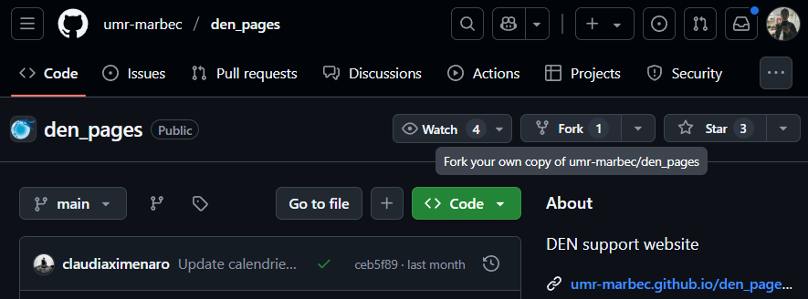

Un petit formulaire va s'ouvrir et nous montrer ce qui va se passer (c'est à dire que le processus `fork` va avoir lieu), il ne nous reste plus qu'à cliquer sur le bouton **Fork**.

Super, à partir de maintenant, dans notre profil Github apparaîtra le dépôt DEN Pages, avec un label indiquant qu'il s'agit d'un *Fork from umr-marbec/den_pages*. Dans cette version fork nous pouvons faire des changements et des éditions parce qu'elle est déjà dans notre compte, mais en même temps elle maintient un lien interne avec le dépôt original, ce qui deviendra important dans les étapes suivantes.

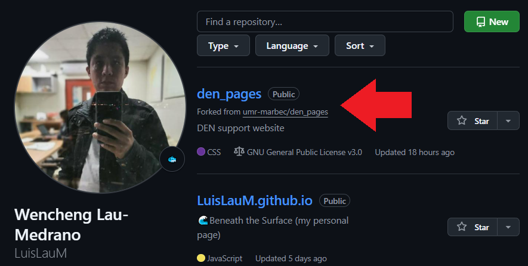

## Cloner le dépôt 

La prochaine étape importante est d'avoir une copie du dépôt Marbec DEN (la version `fork`) sur notre PC. Pour ce faire, nous allons d'abord aller sur le site web du dépôt `fork` et à l'intérieur du bouton vert appelé `<> Code`, copier le lien HTTPS qui s'y trouve.

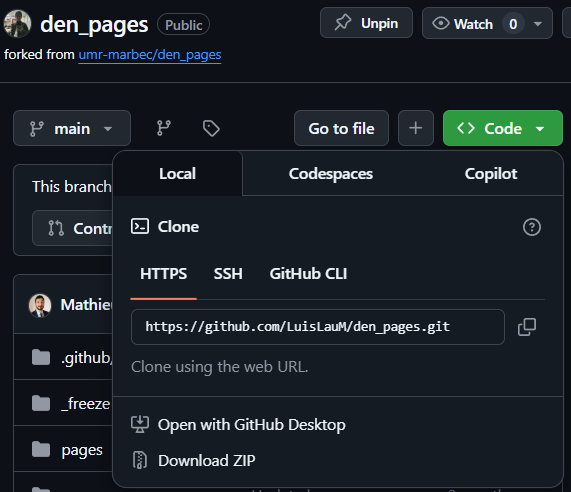

:::{.callout-important}
Chaque lien sera différent car il dépendra du nom de chaque utilisateur, donc **N'ESSAYEZ PAS** d'utiliser le lien du dépôt `fork` de quelqu'un d'autre.
:::

Ensuite, nous allons ouvrir notre IDE et créer un projet à partir de ce lien de dépôt :

* Dans RStudio, il suffira d'aller dans le menu *File→New project*. Ensuite, dans la fenêtre qui s'ouvrira, nous choisirons l'option *Version Control*, puis l'option *Git* et enfin dans la dernière fenêtre nous collerons l'URL copiée dans l'étape précédente et cliquerons sur le bouton *Create project*.

  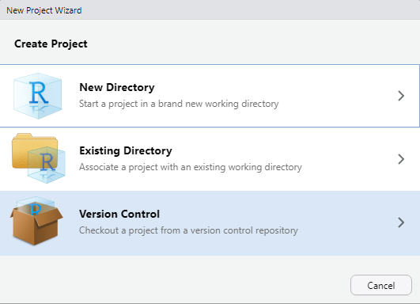
  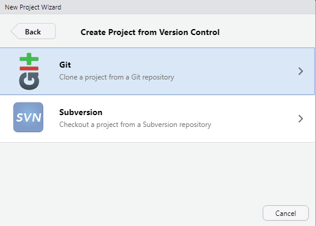
  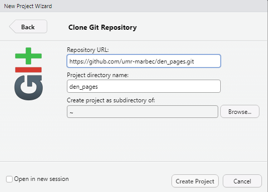

* Dans Positron, il suffira d'aller dans le menu *File→New folder from Git*. Ensuite, dans la fenêtre qui s'ouvrira, il faudra coller l'URL copiée dans l'étape précédente. Nous pourrons choisir le dossier dans lequel nous voulons que le dossier du projet soit créé (nous recommandons de NE PAS laisser le dossier par défaut, à moins que nous soyons complètement sûrs que c'est le bon emplacement) et enfin cliquer sur *OK*. Positron affichera une petite fenêtre de progression en bas et ouvrira le projet une fois le téléchargement terminé.

  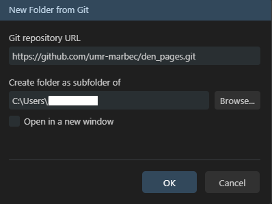
  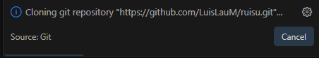

Dans les deux cas, un dossier sera créé avec le nom du dépôt qui contiendra tout ce qui est nécessaire pour déployer le site web sur votre PC.

## Effectuer les changements localement

A partir de maintenant, nous pouvons effectuer les changements souhaités :

* Si nous voulons seulement suggérer un changement dans une figure ou une capture d'écran (par exemple, parce que nous considérons qu'elle est obsolète ou qu'elle n'a pas l'air correcte), il suffira de remplacer le fichier image par le nouveau. La même procédure s'applique au remplacement de tout fichier non textuel.

* Si nous voulons suggérer **l'édition du contenu d'un fichier texte** (par exemple, un script ou un fichier Quarto `.qmd`), il suffit d'ouvrir le fichier désiré dans notre IDE (RStudio, Positron ou tout autre) et d'effectuer les éditions correspondantes.

* Si nous voulons ajouter un nouvel article, il suffira de créer le fichier `.qmd` correspondant dans le dossier approprié. Si vous ne voulez pas partir de zéro, vous pouvez toujours utiliser l'un des billets existants comme modèle, mais la structure de presque tous les billets est un (sous-)dossier contenant : un fichier `.qmd`, un fichier image qui sert de bannière au billet et un sous-dossier `images/` où sont stockées les images nécessaires au billet ; bien sûr, votre billet peut nécessiter des fichiers supplémentaires (par exemple, des tableaux au format CSV ou MS Excel), assurez-vous simplement qu'ils sont toujours situés À L'INTÉRIEUR du sous-dossier de votre billet. Enfin, n'oubliez pas que DEN Pages a pour principe d'afficher les contenus rédigés en français et en anglais, dans cet ordre.

:::{.callout-tip}
## Quarto

Nous vous recommandons donc de visiter leur [site officiel](https://quarto.org/docs/websites/) pour vous familiariser avec les outils disponibles afin de rendre votre article aussi didactique que possible.
:::

Une fois que vous avez effectué les modifications souhaitées, l'étape suivante consiste à vérifier que tout fonctionne correctement, c'est-à-dire que vous êtes en mesure de compiler le site web DEN Pages sur votre PC :

* Nous ouvrirons n'importe quel fichier `.qmd` disponible. Si notre changement implique la création de fichiers `.qmd` eux-mêmes, il serait préférable d'ouvrir l'un d'entre eux.

* Ensuite, nous donnerons la commande pour rendre le fichier `.qmd` : 
  
  * Dans RStudio, dans l'onglet actif du fichier `.qmd` sélectionné, nous cliquerons sur le bouton *Render*.

    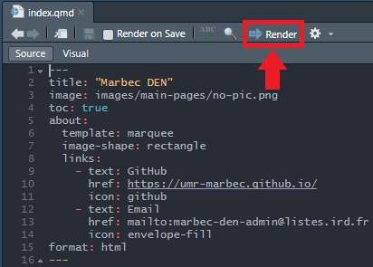

  * Dans Positron, dans l'onglet actif du fichier `.qmd` sélectionné, cliquez sur un petit bouton (*Preview*) situé dans la barre immédiatement au-dessus de notre éditeur.

    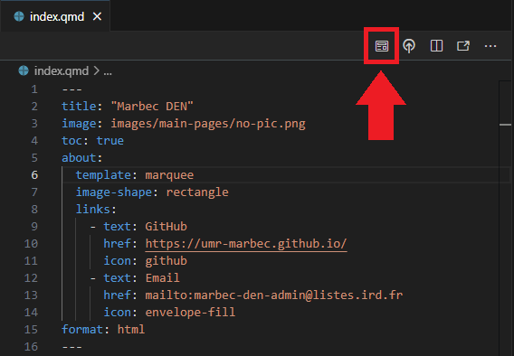

Dans tous les cas, notre IDE exécutera dans son terminal interne une commande de rendu Quarto et, s'il n'y a pas de problème, il ouvrira une prévisualisation du site web qui s'exécutera UNIQUEMENT sur notre PC. Ce mode de prévisualisation sert à corriger d'éventuels problèmes d'espacement ou d'affichage. Si une erreur se produit et que la prévisualisation ne se charge pas, nous devrons chercher la cause sur Internet. Oui, cela peut sembler TRÈS général, mais la vérité est que les erreurs qui peuvent se produire à ce niveau dépendent beaucoup du changement que nous faisons, de sorte qu'il n'est même pas possible de placer une liste d'erreurs-solutions, parce que ce guide ne se terminerait jamais.

## Téléchargement des changements dans notre référentiel `fork`.

Prêt, à ce stade, une fois que vous êtes satisfait des changements/modifications effectués, il est temps de les appliquer au web en production. Cependant, nous devons nous rappeler qu'en tant qu'utilisateurs externes, tous les changements doivent être revus, testés et approuvés par les administrateurs.

La première étape consiste à télécharger les changements dans notre référentiel `fork`, où nous avons les droits d'écriture. Pour cela, nous pourrons utiliser les outils de l'IDE que nous utilisons :

### Dans RStudio

* Nous devrons cliquer sur un bouton qui montre le mot Git en vertical, situé dans la barre d'outils de RStudio.

  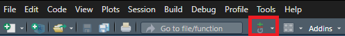

* Dans le menu affiché, choisissez l'option *Commit*.

  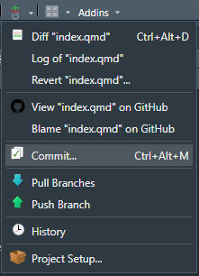

* Une fenêtre s'ouvre et affiche tous les fichiers dans lesquels nous avons effectué des modifications. 

  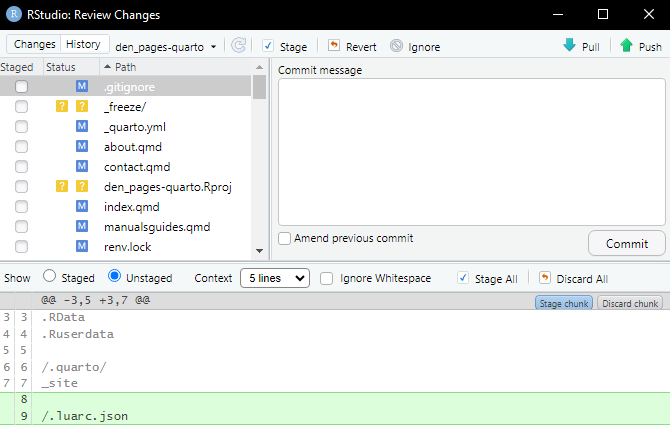
  
* Dans cette fenêtre, nous devrons sélectionner TOUS les éléments, en utilisant le raccourci `Ctrl + A` (sous Windows/Linux) ou `Cmd + A` (sous MacOS).

  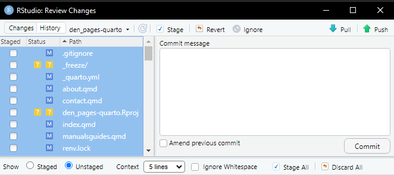

* Une fois qu'ils sont tous sélectionnés, cliquez sur le bouton *☑ Stage* (en haut), et assurez-vous que TOUS les éléments ont une coche à gauche.

  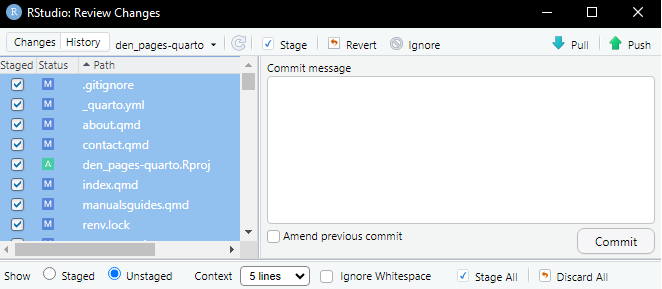

* Ensuite, dans le panneau *Commit message*, nous allons écrire une TRES brève description des changements que nous avons effectués. Le texte doit être concis (pas plus d'une phrase), mais suffisamment clair pour donner aux administrateurs un aperçu des changements effectués. A la fin, cliquez sur le bouton *Commit*.

  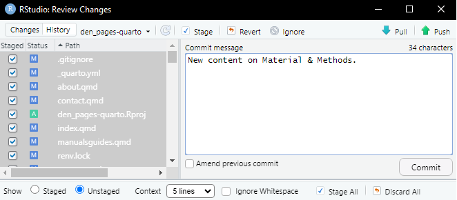

* Nous attendrons un peu que le processus se termine (cela ne devrait pas prendre plus de quelques secondes) et après tout, nous cliquerons sur le bouton *⬆ Push* et une fois de plus, nous attendrons que le processus se termine (cela peut prendre plusieurs secondes ou minutes, en fonction de la quantité de fichiers édités, ajoutés, ainsi que de notre vitesse internet).

### Dans Positron

* Dans la barre latérale (à gauche), cliquez sur une icône qui fait référence au système de contrôle de version : .

  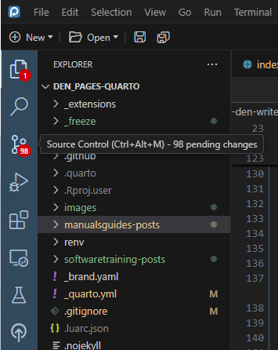

* Dans le panneau qui s'ouvre, tous les fichiers ajoutés, édités ou supprimés sont affichés. Nous allons passer le curseur à droite du titre du sous-panneau *Source Control* et nous verrons qu'un bouton apparaîtra comme une coche. Il s'agit du bouton *Commit*, sur lequel nous allons cliquer.

  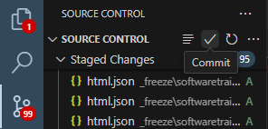

* Dans le panneau de l'éditeur, un fichier contenant la liste de toutes les modifications sera ouvert en tant que commentaire (c'est-à-dire commençant par le symbole `#`). De plus, le curseur sera positionné sur la ligne 1, attendant que nous écrivions une TRES brève description des changements que nous avons effectués. Le texte doit être concis (pas plus d'une phrase), mais suffisamment clair pour donner aux administrateurs un aperçu des modifications apportées. A la fin, cliquez sur le bouton ✔ en haut de ce panneau.

  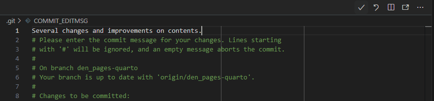

* Une fenêtre de confirmation apparaît, cliquez sur *OK*.

  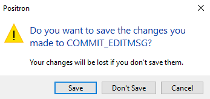

* Maintenant, dans le panneau *Source Control*, le bouton *Sync Changes* sera activé, ce qui nous permettra de `pousser` les changements effectués vers le dépôt Github. Nous allons cliquer sur ce bouton.

  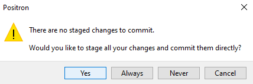

* Un autre message de confirmation sera affiché et nous cliquerons sur *OK*.

  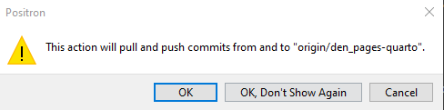

### Vérification des modifications

Terminé. Indépendamment de l'IDE utilisé, nous pouvons toujours vérifier que les changements ont été téléchargés avec succès en allant sur notre dépôt `fork` sur Github et en vérifiant que les changements y apparaissent déjà.

## Télécharger les changements vers le dépôt officiel

Si nous sommes sur la page Github de notre dépôt, nous verrons qu'un bouton appelé *Compare & Pull request* a été activé. 

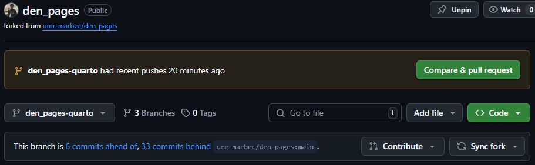

En cliquant sur ce bouton, un formulaire s'ouvrira dans lequel nous pourrons écrire un message rapide sur les changements que nous avons effectués. Ce message sera montré aux administrateurs, mais en même temps il sera public, c'est pourquoi nous devons aussi être clairs et concis dans la description donnée. Une fois que nous avons terminé, il suffit de cliquer sur le bouton *Create pull request*. 

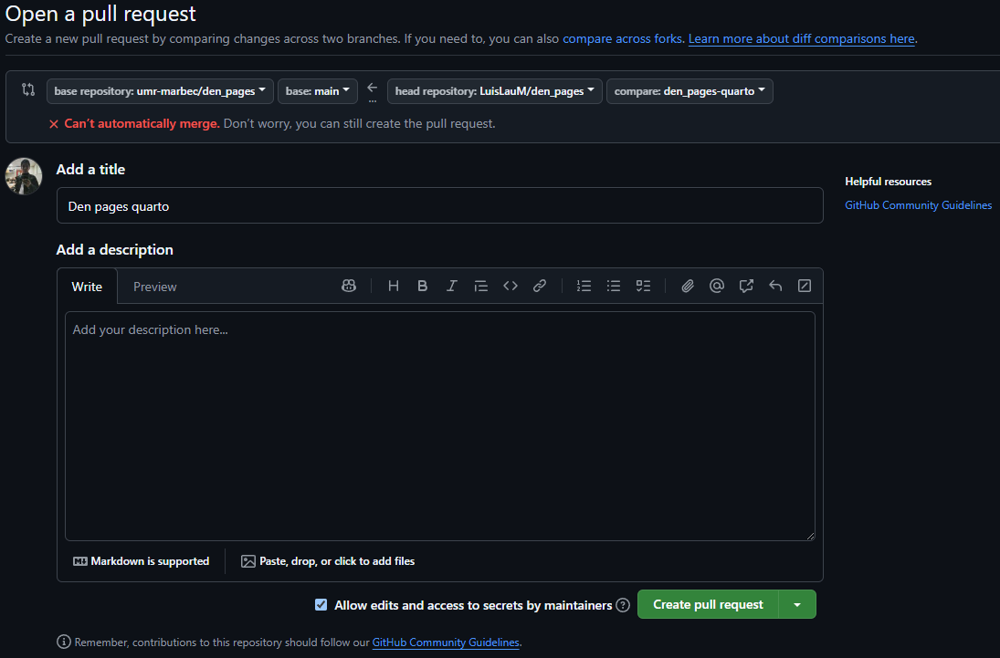

C'est fait, il ne reste plus qu'à attendre que les administrateurs revoient nos modifications et les ajoutent à la version de production de DEN Pages.

---

# [EN] How to write/edit a post for Marbec DEN?

If you have arrived here, you are interested in supporting this website and **we really appreciate it**. Let's get straight to the point, and we'll start with the software you'll need:

* **Have a Github account**, since that is the platform where this website is hosted. This step is relatively simple, just go to the [Github](https://github.com/) website, choose the Sign up option and fill in the required fields.

* **Download and install the version control software Git** from its [official website](https://git-scm.com/downloads) and depending on your PC operating system.

* **Download and install Quarto** from its [official website](https://quarto.org/docs/get-started/) and according to your PC operating system. This software is the platform on which the DEN pages website is built.

* **You need to have some software that allows you to edit code and manage Git repositories**. Basically, you need an IDE. While you could do everything from a Terminal window, this is not recommended. There are many very good IDEs out there, most of which also offer tools to manage repository-hosted content. In this example, we will show how to do it in Positron and RStudio.

:::{.callout-note}
## Positron

Positron is a new open-source IDE developed by Posit, designed primarily for data science and analytics. It is a **fork of VS Code**, meaning it is built on the same foundation but tailored to Posit's ecosystem, with better integration for R, Python, and Quarto. Positron aims to provide a more stable and customized experience for data scientists, addressing some of the limitations of VS Code while maintaining compatibility with its extensions and features.
:::

* Any other software you are going to use in your content**, this includes programming languages (R, Python, C++, Java, etc.) or the libraries necessary for these packages to work. This example will be fairly basic, so it will not require you to use any specialized software.

## Making a copy (`fork`) of the repository 

The DEN Pages repository is managed by the [Marbec DEN team](/contact.qmd) and they are the only ones authorized to accept, deny or revert any change to the website content. So, being us an external user, the procedure to submit a change or edit request on this repository is first to obtain a copy of the DEN Pages repository in our own Github account.

To do this, we will go to the repository website on Github and click on the **Fork** button, which is located between the *Watch* and *Star* buttons.

A small form will open where it will show us what is going to happen (i.e., that the `fork` process will take place), so we just need to click on the **Create fork** button.

Great, from now on, in our Github profile will appear added the DEN Pages repository, with a label indicating that it is a *Fork from umr-marbec/den_pages*. In this fork version we can make changes and edits because it is already inside our account, but at the same time it maintains an internal link with the original repository, which will become important in the following steps.

## Clone repository 

The next important step is to have a copy of the Marbec DEN repository (the `fork` version) on our PC. To do this, we will first go to the `fork` repository website and inside the green button called `<> Code`, copy the HTTPS link shown there.

:::{.callout-important}
Each link will be different as it will depend on each user's name, so **DO NOT** try to use someone else's `fork` repository link.
:::

Next, we will open our IDE and create a project from this repository link:

* In RStudio, it will be enough to go to the menu *File→New project*. Then, in the window that will open, we will choose the *Version Control* option, then the *Git* option and finally in the last window we will paste the URL copied in the previous step and click on the *Create Project* button.

  
  
  

* In Positron, it will be enough to go to the menu *File→New folder from Git*. Then, in the window that will open, paste the URL copied in the previous step. We will be able to choose the folder where we want the project folder to be created (we recommend NOT to leave the default folder, unless we are completely sure that this is the right location) and finally click on *OK*. Positron will show a small progress window at the bottom and will open the project once the download is finished.

  
  

In either case, a folder will be created with the name of the repository that will contain everything necessary to deploy the web site on your PC.

## Making the changes locally

From this point on, we can make the desired changes:

* If we only want to suggest a change in some figure or screenshot (for example, because we consider that it is outdated or does not look correctly), it will be enough to replace the image file with the new one. The same procedure applies for the replacement of any non-text file.

* If we want to suggest **editing the content of some text file** (e.g., a script or a Quarto `.qmd` file), we just need to open the desired file in our IDE (RStudio, Positron or any other) and make the corresponding edits.

* If we want to add a new post, it will be enough to create the corresponding `.qmd` file inside the appropriate folder. If you do not want to start from scratch, you can always use any of the existing posts as a template, but the structure in almost all of them is a (sub)folder containing: a `.qmd` file, an image file that serves as the post banner and an `images/` subfolder where the images required for the post are stored; of course your post might require additional files (e.g., tables in CSV or MS Excel format), just make sure they are always located INSIDE the subfolder of your post. Finally, keep in mind that DEN Pages has as a principle to display content written in French and English, in that order.

:::{.callout-tip}
## Quarto

DEN Pages uses Quarto as a framework for building the website, so we recommend that you visit their [official website](https://quarto.org/docs/websites/) to learn about the tools available to make your post as didactic as possible.
:::

Once you have made the desired changes, the next step will be to check that everything is working correctly, i.e. that you are able to compile the DEN Pages web site on your PC:

* We will open any of the `.qmd` files available. If our change involved the creation of `.qmd` files themselves, then it would be preferable to open one of these.

* Next, we will give the command to render the `.qmd` file: 
  
  * In RStudio, in the active tab of the selected `.qmd` file, we will click on the *Render* button.

    

  * In Positron, in the active tab of the selected `.qmd` file, click on a small button (*Preview*) located in the bar immediately above our Editor.

    

In any of the cases, what will happen is that our IDE will execute in its internal Terminal a Quarto rendering command and, if there is no problem, it will open a preview of the web site that will be running ONLY in our PC. This preview mode serves to correct possible spacing or display problems. If an error occurs and the preview does not load, we will have to search the Internet for the cause. Yes, this may sound VERY general, but the truth is that errors that may occur at this level will depend a lot on the change we are making, so it is not even possible to place a list of errors-solutions, because this guide would never end.

## Uploading the changes to our `fork` repository

Ready, at this point, once you are happy with the changes/edits made, it is time to apply them to the web in production. However, we must remember that as external users, all changes must be reviewed, tested and approved by the administrators.

The first step is to upload the changes to our `fork` repository, where we do have write permissions. For it, we will be able to use the tools of the IDE that we are using:

### In RStudio

* We will have to click on a button that shows the word Git in vertical, located in the toolbar of RStudio.

  

* In the displayed menu, choose the *Commit* option.

  

* A window will open showing all the files where we have made changes. 

  
  
* In this window, we will have to select ALL the items, using the shortcut `Ctrl + A` (in Windows/Linux) or `Cmd + A` (in MacOS).

  

* Once they are all selected, click on the *☑ Stage* button (at the top), and make sure that ALL items have a check mark on the left.

  

* Next, in the *Commit message* panel we will write a VERY brief description of the changes we have made. The text should be concise (no more than one sentence), but clear enough to give the administrators a hint of the changes made. At the end, click the *Commit* button.

  

* We will wait a while for the process to finish (it should not take more than a few seconds) and after all we will click on the *⬆ Push* button and once again, we will wait for the process to finish (this could take several seconds or minutes, depending on the amount of files edited, added, as well as our internet speed).

### In Positron

* In the sidebar (left), click on an icon that refers to the version control system: .

  

* In the panel that will open, all the added, edited or removed files will be shown. We will pass the cursor to the right of the title of the Source Control subpanel and we will see that a button will appear as a check. That is the Commit button, we will click on it.

  

* In the Editor panel, a file with the list of all changes will be opened as a comment (i.e., starting with the `#` symbol). Also, the cursor will be positioned on line 1 waiting for us to write a VERY brief description of the changes we have made. The text should be concise (no more than one sentence), but clear enough to give the administrators a hint of the changes made. At the end, click on the check button (✔) at the top of this panel.

  

* A confirmation window will appear, click on *OK*.

  

* Now, in the *Source Control* panel the *Sync Changes* button will be enabled, which will allow us to `push` the changes made to the Github repository. We will click on that button.

  

* Another confirmation message will be displayed where we will click on *OK*.

  

### Checking the changes

Done. Regardless of the IDE used, we can always check that the changes have been successfully uploaded by going to our `fork` repository on Github and checking that the changes already appear there.

## Uploading the changes to the official repository

If we are on the Github page of our repository, we will see that now a button called *Pull request* has been enabled. 

Clicking on this button will open a form where we can write a quick review of the changes we have made. This message will be shown to the administrators, but at the same time it will be public, so we must also be clear and concise in the description given. Once we have finished, just click on the *Create pull request* button. 

Done, now we just have to wait for the administrators to review our changes and add them to the production version of DEN Pages.

