Image credits: Faris Mohammed at [Unplash](https://unsplash.com/photos/green-sprout-growing-between-re-bars-nYGVN45DOHg?utm_content=creditShareLink&utm_medium=referral&utm_source=unsplash)

# [FR] Exécuter un script R sur Marbec-GPU à partir de zéro

Dans ce tutoriel, nous verrons comment exécuter un script R sur le HPC Marbec-GPU en partant de (presque) zéro. Bien que nous utilisions RStudio Server pour éditer notre script dans cet exemple, nous n'exécuterons PAS notre code dans RStudio. À la place, nous l'exécuterons en utilisant des commandes SLURM via un script BASH dans le terminal de JupyterLab sur Marbec-GPU. C'est la méthode recommandée pour exécuter des scripts nécessitant l'utilisation de plusieurs cœurs/threads ou de GPU.  

:::{.callout-note}  
Dans ce post, nous utiliserons souvent le terme HPC, qui signifie "High-Performance Computing device" (dispositif de calcul haute performance). En termes très simples, il s'agit d'un ordinateur très puissant dont les ressources peuvent être utilisées par plusieurs utilisateurs en même temps. Pour plus de détails sur les caractéristiques de Marbec-GPU et Marbec-DATA, veuillez consulter notre post [Documentation Marbec-GPU](/servers.qmd).  
::: 

## AVANT DE COMMENCER  

### Prérequis  

* Vous devez avoir un compte actif sur Marbec-GPU et Marbec-DATA. Si vous n'avez pas de compte sur l'une de ces plateformes, veuillez contacter les administrateurs :  
  - Claudia Restrepo-Ortiz ([claudia.restrepo-ortiz@ird.fr](mailto:claudia.restrepo-ortiz@ird.fr))  
  - Nicolas Barrier ([nicolas.barrier@ird.fr](mailto:nicolas.barrier@ird.fr))  

* Installez le logiciel [FileZilla](https://filezilla-project.org/), que nous utiliserons pour transférer les fichiers d'entrée et de sortie entre notre PC et Marbec-DATA. Vous pouvez trouver les étapes de téléchargement, d'installation et de connexion à FileZilla dans notre post : [Gérer des fichiers depuis/vers Marbec-DATA](/manualsguides-posts/marbec-data-manage-files/marbec-data-manage-files.qmd).  

### Répertoire de travail  

L'une des principales recommandations lorsque l'on travaille avec R est de bien définir un dossier qui contiendra les fichiers d'entrée/sortie ainsi que les scripts nécessaires pour obtenir nos résultats. Avoir un compte actif sur Marbec-DATA signifie qu'il existe également un dossier portant notre nom d'utilisateur, auquel Marbec-GPU peut accéder.  

La première étape consiste à créer un dossier qui servira de répertoire de travail. Il existe plusieurs façons de le faire : via l'interface web de Marbec-DATA, via une fenêtre de terminal JupyterLab ou en créant un projet RStudio Server. Ici, nous utiliserons la troisième méthode, car elle nous permet de tout gérer au sein d'un projet RStudio.  

* Connectez-vous à Marbec-GPU via le lien [marbec-gpu.ird.fr](https://marbec-gpu.ird.fr/) et sélectionnez la première option de serveur (c'est-à-dire la plus simple).  

* L'interface web de JupyterLab apparaîtra. Cliquez sur l'icône RStudio Server. 

  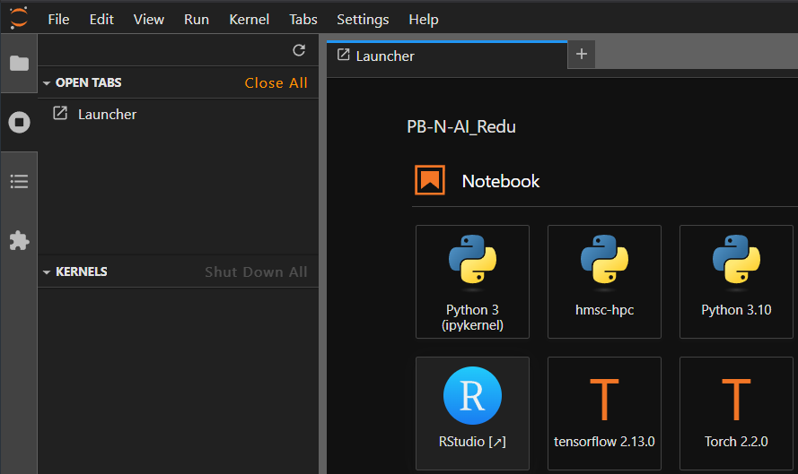

* Un nouvel onglet s'ouvrira avec l'interface de RStudio Server, qui est TRÈS similaire à RStudio Desktop, bien que légèrement différente. Sélectionnez **File → New Project**.  

  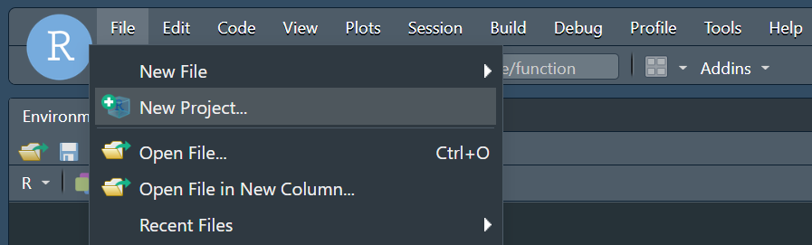  

* Choisissez **New Directory**, puis **New Project**, et enfin, entrez le nom de ce nouveau projet (qui sera également le nom de notre répertoire de travail). Cliquez sur **Create Project** pour finaliser.  

  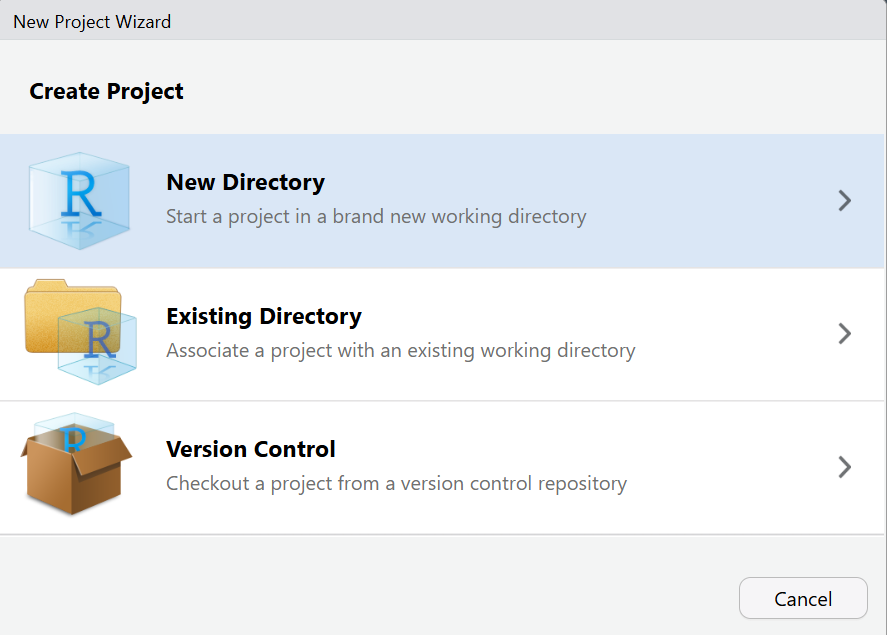  

  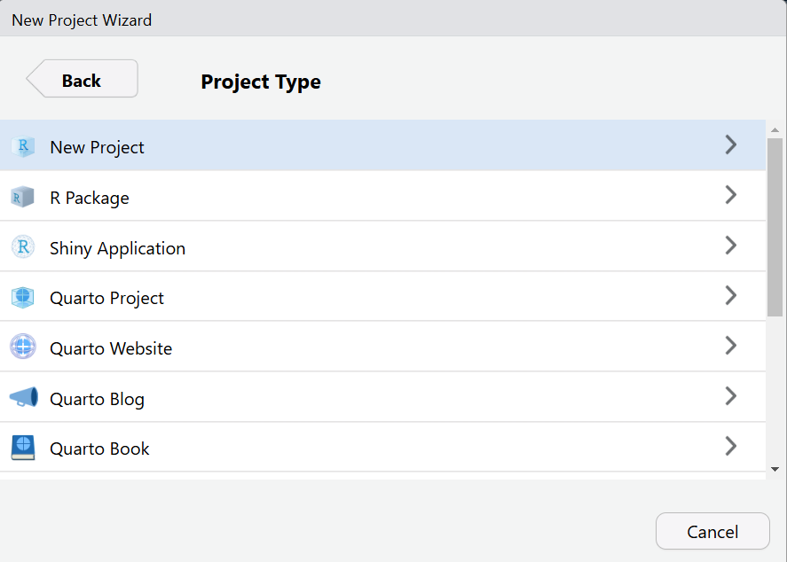  

  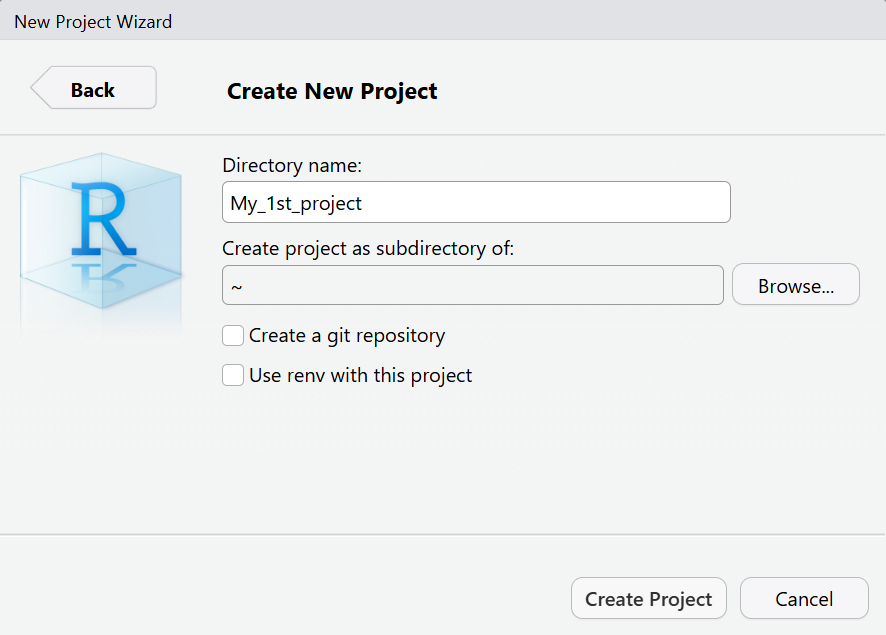  

:::{.callout-warning}  
Il est possible que le dossier sur lequel vous travaillez SOIT DÉJÀ ou se trouve à l'intérieur d'un dossier qui EST DÉJÀ disponible (visible) pour Marbec-Data. Dans ce cas, l'étape suivante n'est pas nécessaire puisque Marbec-GPU aura déjà accès à votre dossier et que tout adressage sera effectué par le script BASH, dont vous verrez la création dans les prochaines étapes de ce billet.

En d'autres termes, l'étape suivante n'est recommandée qu'aux utilisateurs qui n'ont PAS de dossier associé à Marbec-DATA, ou qui souhaitent ouvrir leur répertoire de travail en tant que nouveau dossier dans Marbec-DATA.
:::  

* Rendre notre dossier visible dans Marbec-DATA. Cela se fait au moyen d'un lien symbolique. Pour ce faire, il suffit d'aller dans le panneau Terminal de RStudio (on peut aussi le faire à partir d'une fenêtre Terminal de JupyterLab) et d'exécuter la commande suivante :

```bash
# Ici, vous devez remplacer les valeurs de 
# your_username et your_folder en conséquence
cd /home/your_username/ && ln -s /marbec-data/your_folder
```

### Fichiers d'entrée  

Super ! Maintenant que nous avons notre répertoire de travail, l'étape suivante consiste à y copier les fichiers nécessaires en utilisant FileZilla. Vous pouvez retrouver les étapes à suivre dans notre post : [Gérer des fichiers depuis/vers Marbec-DATA](/manualsguides-posts/marbec-data-manage-files/marbec-data-manage-files.qmd).  

:::{.callout-note}  
Une bonne pratique consiste à organiser votre répertoire de travail avec des sous-répertoires pour différents types de fichiers. Par exemple :  
- 📁 **raw** (données brutes)  
- 📁 **inputs** (fichiers d'entrée traités)  
- 📁 **outputs** (résultats)  
- 📁 **code** (scripts)  
- 📁 **figures** (graphes et images)  
:::  


### Préparation de notre script R  

Si vous avez décidé d'utiliser Marbec-GPU pour votre script R, il existe deux scénarios possibles :  

* Vous avez un script qui fonctionne bien sur votre PC mais qui utilise un seul cœur, et vous souhaitez paralléliser son exécution sur Marbec-GPU. Dans ce cas, nous vous recommandons de développer d'abord une version parallélisée de votre script sur votre PC en utilisant un minimum de ressources (par exemple, 2 cœurs de traitement). Une fois que vous avez exécuté ce script sur votre PC et vérifié qu'il produit les résultats attendus, son exécution sur Marbec-GPU sera très simple. Si vous souhaitez apprendre à paralléliser un script rapidement, vous pouvez consulter notre post dédié à ce sujet.  

* Vous avez déjà un script qui utilise plusieurs cœurs et fonctionne relativement bien sur votre PC, mais vous ne pouvez pas l'exécuter complètement en raison de ressources limitées (cœurs CPU, RAM ou GPU).  

:::{.callout-warning}  
Pour poursuivre les prochaines étapes, vous devez disposer d'un script parallélisé fonctionnel que vous avez déjà exécuté avec succès sur votre PC et dont vous avez confirmé le bon fonctionnement.  
:::  

Maintenant, dans notre interface web de RStudio Server, nous allons ouvrir notre script R et effectuer les vérifications suivantes :  

* Vérifiez toutes les références aux fichiers (entrée ou sortie) afin d'éviter les erreurs de type "Fichier introuvable" ou "Chemin incorrect". Une méthode simple pour cela est d'utiliser la touche **Tab** (de notre clavier) lors de la saisie des chemins de fichiers afin que RStudio complète automatiquement le bon chemin dans notre **répertoire de travail**.

  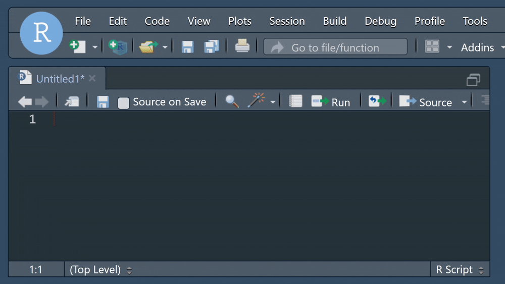

* Vérifiez que tous les packages requis pour notre script sont installés sur Marbec-GPU. Pour cela, il suffit d'essayer de charger chaque package avec les fonctions `require` ou `library`. Si un package est manquant, nous pouvons l'installer avec la fonction `install.packages` ou via la méthode standard dans RStudio, c'est-à-dire via **Tools → Install Packages**.  

* Assurez-vous que notre script R enregistre explicitement les résultats souhaités. Par exemple, si nous générons des figures en utilisant l'environnement **graphics**, nous devons inclure des lignes qui sauvegardent ces figures (`png`, `jpeg`, `pdf`, et `dev.off`). De même, si nous utilisons **ggplot2**, nous devons enregistrer les graphiques en conséquence. Si notre script génère des tableaux, nous devons les enregistrer au format CSV, XLSX ou tout autre format permettant de les lire ultérieurement. Enfin, si le script produit des objets complexes (par exemple, des sorties GAM, des listes ou des objets spécifiques à certains packages), nous pouvons utiliser la fonction `saveRDS` pour les stocker dans un format binaire et les récupérer plus tard sur notre PC.  

:::{.callout-note}  
## Objets spécifiques  

Certains objets propres à des packages nécessitent une manipulation particulière lors de leur sauvegarde. Il est toujours recommandé de consulter la documentation du package et d'utiliser ses fonctions dédiées. Un exemple clair est le package **terra**, qui possède sa propre version de `saveRDS` pour ses objets principaux. Lors de l'enregistrement d'objets de ce package, nous devons explicitement utiliser `terra::saveRDS`.  
:::  

* Si notre script génère des fichiers de sortie, nous devons nous assurer que les sous-répertoires dans lesquels ces fichiers seront stockés i) **existent déjà** dans notre **répertoire de travail** (sinon, ils peuvent être créés via l'interface web de Marbec-DATA, FileZilla ou un terminal avec la commande `mkdir nom_sous_dossier/`), ou ii) **seront créés directement dans le script**, en ajoutant des commandes explicites en R comme `dir.create`.  

* Une pratique **fortement recommandée** consiste à ajouter des commandes affichant des messages permettant de suivre l'avancement du script. Prenons un exemple : imaginons que notre script comporte trois étapes principales—lecture des fichiers, analyse des données et génération des figures. À la fin de chaque étape, nous devrions insérer une ligne de code affichant un message indiquant sa réussite (avec des fonctions comme `print`, `cat` ou `message`). Cela peut ne pas sembler crucial lors de l'exécution d'un script dans RStudio, puisque nous pouvons toujours vérifier la Console pour voir où en est l'exécution. Cependant, lorsque nous exécutons un script via une commande BASH (ce que nous verrons dans les prochaines étapes), nous n'aurons pas d'interface conviviale pour suivre la progression—sauf si nous incluons des instructions d'affichage explicites, comme `r print("Lecture des données [OK]")` ou `r cat("\nFigure 1 [OK]")`.  

Ainsi, en cas d'erreur, il sera beaucoup plus facile de déterminer où le script s'est bien exécuté (c'est-à-dire le dernier message affiché) et donc d'identifier la source potentielle du problème.  

:::{.callout-note}  
N'hésitez pas à ajouter des messages d'affichage ! Si votre script exécute des processus à l'intérieur d'une boucle (c'est-à-dire dans une instruction `for` ou `while`), il est conseillé d'inclure un message juste avant la fin de la boucle. Exemple :  

```r
for(j in 1:100){
  # Un processus intéressant ici  
  
  cat(sprintf(fmt = "Étape %i terminée", j))
}
```
:::  

:::{.callout-important}
## NE PAS exécuter à partir du serveur RStudio  

Bien qu'il soit possible d'exécuter un script à partir de l'interface du RStudio Server, ce n'est PAS une bonne pratique pour de nombreuses raisons :

* Gestion de la charge de travail et des files d'attente : Dans Marbec-GPU, les ressources informatiques sont allouées par l'intermédiaire d'un gestionnaire de file d'attente (SLURM), de sorte que si vous lancez un script complexe à partir de RStudio Server, il ne passera PAS par le gestionnaire de file d'attente, ce qui peut entraîner (i) une mauvaise utilisation des nœuds de calcul, (ii) l'abandon du script en raison d'une consommation excessive de ressources, ou (iii) des retards pour d'autres tâches dans le système.

* Utilisation inefficace des ressources : Le RStudio Server n'est PAS conçu pour gérer des calculs intensifs ; en revanche, un script lancé à l'aide d'un SLURM BASH peut tirer parti de l'ensemble de l'infrastructure de la grappe.

* Stabilité : Le RStudio Server est sujet à des dépassements de temps et à des limitations de session. Si votre script prend trop de temps, la session peut être fermée et la progression perdue. En revanche, les scripts exécutés par l'intermédiaire du gestionnaire de files d'attente s'exécutent en toute sécurité et en arrière-plan, évitant ainsi les interruptions inattendues.

Utilisez RStudio Server comme IDE, c'est-à-dire pour créer ou modifier des scripts ou pour exécuter des processus très basiques tels que l'obtention d'une liste de dossiers ou de fichiers, des opérations arithmétiques simples, l'exécution des premières étapes d'un script pour s'assurer qu'il charge correctement les fichiers, etc. Tout autre test qui implique un calcul complexe (par exemple, tester une boucle multithread), il est recommandé de le faire sur votre PC AVANT de le charger dans Marbec-GPU.

N'oubliez pas que les administrateurs de Marbec-GPU surveillent constamment l'utilisation des ressources et que **tout script complexe lancé à partir du RStudio Server est susceptible d'être interrompu**.
:::

### Préparation de notre script BASH  

Super ! Nous avons maintenant notre répertoire de travail, nos données d'entrée et notre script R prêts. Il est temps de préparer la commande que nous enverrons à Marbec-GPU pour exécuter tout cela via un **script BASH**. Mais qu'est-ce qu'un script BASH et pourquoi est-il important ?  

Un **script BASH** est un fichier texte contenant une séquence de commandes shell permettant d'automatiser des tâches sur les systèmes basés sur Unix. Dans les environnements de **calcul haute performance (HPC)** utilisant **SLURM (Simple Linux Utility for Resource Management)**, les scripts BASH sont essentiels pour la gestion des tâches et l'allocation des ressources. Ces scripts incluent généralement des **directives SLURM** pour définir les ressources comme les CPU, la mémoire et le temps d'exécution, suivies de commandes pour charger les modules nécessaires et exécuter des programmes (par exemple, un script R ou Python).  

En résumé, un script BASH sert simplement à exécuter notre script R (fichier), mais son importance réside dans la définition des ressources informatiques que le HPC allouera à notre processus.

:::{.callout-note}  
For more complex workflows, a BASH script can orchestrate the execution of multiple scripts in different formats (e.g., various programming languages or frameworks). However, for the purposes of this post, we will focus only on running a single R script within a BASH script.  
:::  

Below, we will present a basic R script that runs a parallelized process:  

```{r}
#| eval: false

require(foreach)
require(doParallel)

# Registering cluster
cl <- makeCluster(spec = 3)
registerDoParallel(cl = cl)
requiredPkgs <- c("dplyr")

# Run multithread process
allBoots <- foreach(i = 1:300, .inorder = FALSE, .packages = requiredPkgs) %dopar% {
  # Simulating a process that last 5 seconds
  Sys.sleep(5)
}

# Finish cluster
stopCluster(cl)
```

Disons que, dans notre répertoire de travail, nous avons enregistré ce script sous le chemin **code/my_script.R**. Maintenant, nous allons créer notre script BASH, que nous enregistrerons directement à la racine de notre répertoire de travail. (*Racine* signifie que ce script ne sera PAS placé dans un sous-dossier, contrairement à notre script R). Nous nommerons ce fichier **my_script_bash.sh**.  

Un fichier BASH est un fichier texte brut, nous pouvons donc le créer directement depuis RStudio Server en allant dans **File → New File → Text File**.  

```bash
#!/bin/bash

#SBATCH --ntasks=2
#SBATCH --mem=2G
#SBATCH --cpus-per-task=2
#SBATCH --job-name=my_1st_job
#SBATCH --error=job_%x_%j.err
#SBATCH --output=job_%x_%j.log

cd $SLURM_SUBMIT_DIR
Rscript code/my_script.R
```

Ensuite, nous l'enregistrons avec le nom spécifié (**my_script_bash.sh**). Il est important de noter que, quel que soit le nom que nous choisissons, il doit TOUJOURS se terminer par **.sh**, car cette extension permet de le reconnaître comme un fichier de script BASH.  

Voyons en détail chaque ligne de notre script BASH :  

* `#!/bin/bash` → Indique que le script doit être exécuté avec le shell **BASH**.  
* `#SBATCH --ntasks=2` → Demande **deux tâches** (processus) pour le travail. Cela signifie que deux cœurs physiques sont alloués à notre processus.  
* `#SBATCH --mem=2G` → Alloue **2 Go de RAM** pour le travail.  
* `#SBATCH --cpus-per-task=2` → Attribue **2 threads** (processeurs logiques) à chaque processeur physique.  
* `#SBATCH --job-name=my_1st_job` → Définit le nom du travail comme **"my_1st_job"** pour une identification plus facile.  
* `#SBATCH --error=job_%x_%j.err` → Redirige les **messages d'erreur** vers un fichier nommé **"job_my_1st_job_JOBID.err"** (`%x` = nom du travail, `%j` = ID du travail).  
* `#SBATCH --output=job_%x_%j.log` → Sauvegarde la **sortie du travail** (y compris les messages affichés) dans **"job_my_1st_job_JOBID.log"**. Ce fichier contiendra également tous les messages explicitement imprimés dans notre script R.  
* `cd $SLURM_SUBMIT_DIR` → Se place dans le **répertoire d'où le travail a été soumis**. Cette ligne est toujours importante, car elle garantit que le répertoire de travail du script BASH est le même que celui utilisé par notre script R.  
* `Rscript code/my_script.R` → Exécute le **script R** (`my_script.R`) situé dans le dossier **"code/"**.  

Un point essentiel à considérer lors de la définition de ces paramètres est que le nombre total de threads alloués doit toujours être **supérieur ou égal** au nombre de processus parallèles définis dans notre script R. Par exemple, si notre script R spécifie `cl <- makeCluster(spec = 3)`, cela signifie que nous utilisons 3 threads parallèles. Par conséquent, dans notre script BASH, le produit de `ntasks` et `cpus-per-task` doit être d'au moins **3**, ce qui est le cas ici.  

:::{.callout-note}  
## `cpus-per-task`  

Au moment de la rédaction de ce guide, Marbec-GPU utilise des processeurs Intel prenant en charge **l'Hyperthreading**, permettant **deux processeurs logiques (threads) par cœur physique**. Cependant, les processeurs plus récents peuvent prendre en charge plus de deux threads par cœur, donc ces informations dépendront toujours du matériel actuellement installé.  
:::  

:::{.callout-warning}  
## Ressources réservées et limitations  

Nous avons dit que, en termes simples, Marbec-GPU est comme un ordinateur très puissant, mais il n'est PAS infiniment puissant. De plus, la puissance de calcul est partagée entre plusieurs utilisateurs, donc il est de notre responsabilité de choisir judicieusement les ressources disponibles.  

Il est donc recommandé que tout script que nous souhaitons exécuter sur Marbec-GPU ait été préalablement testé sur notre PC, non seulement pour vérifier qu'il fonctionne correctement, mais aussi pour évaluer la quantité de ressources qu'il consomme dans certaines conditions, afin d'utiliser ces valeurs pour définir les paramètres que nous réserverons pour l'exécution sur Marbec-GPU. Par exemple, si sur notre PC, notre script utilise 20 Go de RAM avec 8 threads, alors en le faisant tourner avec 16 threads sur Marbec-GPU, nous pourrions allouer environ **40 Go de RAM** (avec le paramètre `mem`). Bien que ce calcul soit approximatif, il est préférable de sous-estimer nos besoins plutôt que de les surestimer et de réserver plus de ressources que nécessaire.  

Encore une fois, Marbec-GPU est une ressource partagée. Si, par exemple, nous réservons 80 Go de RAM alors que notre script n'a besoin que de 40 Go, nous ne recevrons pas d'erreur, mais cette capacité de calcul ne sera PAS disponible pour d'autres utilisateurs, ce qui entraînera des files d'attente plus longues ou empêchera d'autres utilisateurs d'exécuter leurs travaux.  

Soyons responsables.  
:::  

### Exécuter notre script BASH  

Une fois notre script BASH prêt, la dernière étape consiste à l'exécuter dans une fenêtre Terminal. Bien que nous puissions utiliser l'onglet *Terminal* dans RStudio Server, pour plus de clarté et de productivité, nous utiliserons le Terminal fourni par l'interface JupyterLab.  

1. Ouvrez JupyterLab dans votre navigateur en accédant à [marbec-gpu.ird.fr](https://marbec-gpu.ird.fr/).  
2. Sélectionnez l'icône *Terminal*.  

    

3. Un écran de terminal noir classique s'ouvrira, affichant `yourusername@marbec-gpu:~$` avec un curseur clignotant.  

  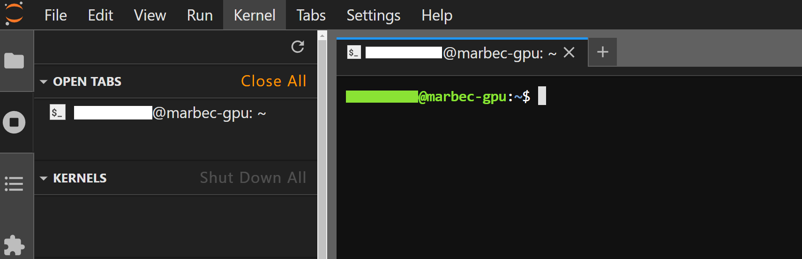  

À ce stade, le terminal est dans votre **répertoire personnel**, vous devez donc vous déplacer vers votre dossier de projet en utilisant la commande `cd`. Si votre dossier de projet s'appelle **My_1st_project**, entrez :  

```bash
cd MyFirstProj
```  

Ensuite, pour vérifier que vous êtes bien au bon endroit, exécutez :  

```bash
ls
```  

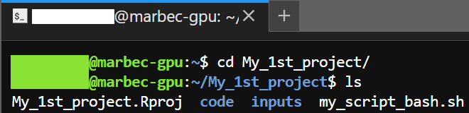  

Cette commande doit lister votre **script BASH** ainsi que le sous-dossier `code/` où est stocké votre script R. Pour vérifier plus en détail, vous pouvez voir le contenu de `code/` avec :  

```bash
ls code/
```  

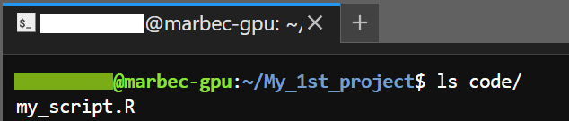  

:::{.callout-tip}  
Comme dans RStudio, dans le Terminal de JupyterLab, il est possible d'utiliser la touche Tab pour compléter automatiquement les commandes ou les chemins vers les fichiers ou dossiers. Si plusieurs éléments commencent par la même séquence de caractères, l'autocomplétion s'arrêtera jusqu'à la partie commune, et vous devrez taper quelques caractères supplémentaires pour préciser votre intention.  
:::


## PENDANT L'EXÉCUTION  

Faisons rapidement le point sur ce que nous devons avoir préparé :  

* Un **répertoire de travail** (dossier de projet).  
* Un **script R**, de préférence dans un sous-dossier `code/`.  
* Des **fichiers de données d'entrée**, idéalement organisés dans des sous-dossiers (`raw/`, `inputs/environmental/sst/`, `inputs/records/`, etc.).  
* Des **sous-dossiers** pour stocker les fichiers de sortie (figures, tableaux, objets R, etc.).  
* Les **packages R nécessaires installés**, ainsi que tout autre logiciel additionnel (ex. : CUDA, Gurobi, etc.).  
* Un **script BASH** stocké à la racine du projet.  

Une fois tout en place :  

1. Ouvrir **JupyterLab** et lancer une fenêtre **Terminal** en sélectionnant l'icône correspondante.  
2. Vérifier que vous êtes bien dans le dossier racine de votre projet (`cd` et `ls` peuvent aider).  
3. Exécuter le script BASH avec :  

```bash
sbatch my_script_bash.sh
```  

Si tout est bien configuré (pas d'erreurs de syntaxe dans le script BASH), un message s'affichera avec l'**ID du job** attribué au processus.  

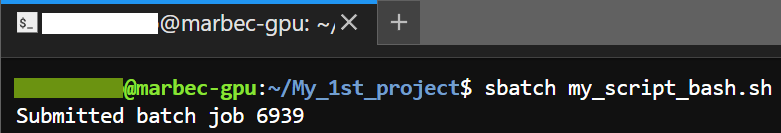  

De plus, en exécutant `ls`, vous devriez voir deux nouveaux fichiers créés :  

* **`job_<NomDuJob>_<jobID>.log`** → Stocke les messages imprimés par le script R.  
* **`job_<NomDuJob>_<jobID>.err`** → Contient les erreurs ou avertissements rencontrés pendant l'exécution.  

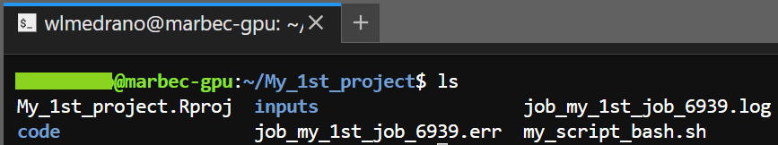  


### Suivi de l'exécution  

Pendant l'exécution du script, plusieurs méthodes permettent de suivre sa progression :  

* Surveiller les fichiers `.log` et `.err`  
Ces fichiers stockent les messages du script et peuvent être ouverts à tout moment avec RStudio Server pour suivre l'avancement.  

:::{.callout-tip}  
## Les commandes `watch` et `tail`  

Pour surveiller en continu les **15 dernières lignes** du fichier `.log`, mises à jour toutes les **10 secondes** :  

```bash
watch -n 10 tail -n 15 job_my_1st_job_9999.log
```  

Remplacez `9999` par l'**ID du job**, récupérable avec `bash squeue`.  

Utile si le script R affiche des messages de progression. Pour **quitter le mode de surveillance**, appuyez sur `Ctrl + C` (Windows/Linux) ou `Cmd + C` (MacOS).  
:::  

* Vérifier le statut du job avec `squeue`  

Grâce à la commande `squeue`, il est possible de surveiller l'état de notre processus et de vérifier depuis combien de temps il est en cours d'exécution. Le résultat de la commande `squeue` dans Terminal peut ressembler à ceci :

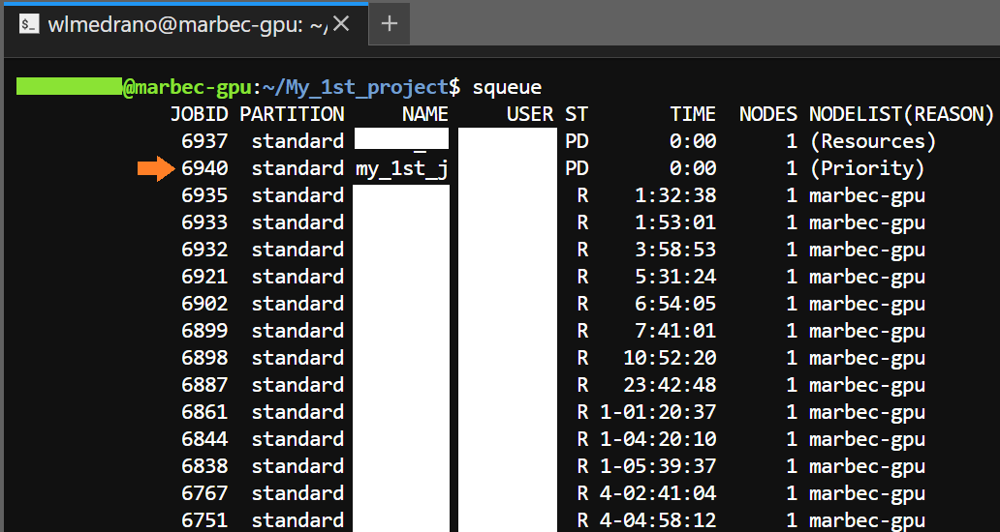

La colonne `ST` montre le statut du processus, tandis que la colonne `NODELIST(REASON)` donne des détails sur ce statut. Dans l'image ci-dessus, vous pouvez voir les trois valeurs les plus courantes qui seront affichées dans la colonne `NODELIST(REASON)` :

* `marbec-gpu` : Indique que notre processus est déjà en cours d'exécution. Dans la colonne `TIME`, nous pouvons visualiser la durée d'exécution de ce processus dans le format **JOURS-HEURES:MINUTES:SECONDES**. Il est important de noter que le processus `spawner-Jupyterhub` fait référence à notre propre session dans Marbec-GPU.

* `(Priority)` : Un ou plusieurs travaux de priorité supérieure sont en file d'attente. Votre travail sera finalement exécuté.

* `(Ressources)` : Le travail attend que des ressources soient disponibles et sera finalement exécuté.

Si vous souhaitez obtenir plus de détails sur les états possibles, nous vous recommandons de consulter cet article : [`squeue` Status and Reason Codes](https://curc.readthedocs.io/en/latest/running-jobs/squeue-status-codes.html#squeue-status-and-reason-codes).

:::{.callout-tip}  
## Voir les détails complets

Par défaut, le résultat de la table `squeue` montre des résultats tronqués. Si vous voulez voir plus de détails, vous devrez l'indiquer à travers l'argument `--format`. Par exemple :

```bash
squeue --format="%.18i %.9P %.30j %.8u %.8T %.10M %.9l %.6D %R"
```

Bien qu'elle puisse sembler compliquée, la syntaxe est assez simple. Il y a plusieurs morceaux de la forme `%.[X][Y]`, où la lettre en position `[Y]` est utilisée pour indiquer la colonne sur laquelle vous voulez changer la longueur du texte, tandis que le nombre en position `[X]` est utilisé pour indiquer le nombre de caractères que vous voulez afficher pour cette colonne.
:::

* Consulter les fichiers de sortie  

On peut aussi suivre l'exécution en examinant les fichiers produits dans les sous-dossiers. Cela peut se faire via (i) **L'interface web de Marbec-DATA**, (ii) **FileZilla** or (iii) **Le Terminal JupyterLab**, avec `bash ls notre/sous_dossier/`  

* Contrôle de l'utilisation des ressources

Surveiller l'utilisation des ressources de notre processus est important car nous pouvons éviter des problèmes tels que le dépassement des limites de stockage allouées, ou l'utilisation inefficace des ressources (par exemple, réserver plus de ressources que notre processus n'en utilise réellement). L'une des façons les plus visuelles d'effectuer cette surveillance est d'utiliser la commande `htop` comme suit :

```bash
htop --user <username> --pid <jobID>

# Exemple
htop --user mcurie --pid 7145
```

Il est recommandé de surveiller au moins les premières minutes ou lorsque vous savez que votre processus fonctionne pleinement. Pour quitter le mode `htop`, appuyez simplement sur la touche `F10` ou sur la combinaison de touches `Ctrl+C` (Windows/Linux) ou `Cmd+C` (MacOS).


:::{.callout-tip}  
## Laissez tout tourner sans souci !  

Deux avantages majeurs de Marbec-GPU :  

* **Ne plus dépendre de son PC** : Pas besoin de le laisser allumé pendant des heures ou des jours ! Beaucoup d'ordinateurs portables ne sont pas conçus pour supporter des charges de calcul intensives sur de longues périodes, ce qui peut entraîner des pannes matérielles (RAM grillée, alimentation surchauffée…).  

* **Accéder au suivi de partout** : Tant qu'on a une connexion internet et un navigateur, on peut suivre l'exécution du script, même depuis un smartphone ! 
:::  


## APRÈS L'EXÉCUTION  

Pour vérifier si le script est terminé, exécutez `bash bash squeue`. Si l'ID du job n'apparaît plus, l'exécution est finie. Ensuite, procédez comme suit :  

* **Vérifier les fichiers `.log` et `.err`** pour voir si tout s'est bien déroulé.  

* **Inspecter rapidement les fichiers de sortie** avec RStudio Server. (⚠ Attention : cette session a une RAM limitée. Si les fichiers sont volumineux, mieux vaut les copier sur son PC.)  

* **Transférer les fichiers de sortie vers son PC** via **FileZilla**. Un guide détaillé est disponible ici :  
[Gestion des fichiers avec Marbec-DATA](/manualsguides-posts/marbec-data-manage-files/marbec-data-manage-files.qmd).

Si vous n'avez pas l'intention d'exécuter à nouveau un processus, une étape finale TRÈS importante consiste à vous déconnecter de Marbec-GPU, afin de permettre l'accès à d'autres utilisateurs qui pourraient être en attente de ressources. Pour ce faire : 

* Allez dans l'interface de JupyterLab et sélectionnez l'option de menu *File → Hub Control Panel*

  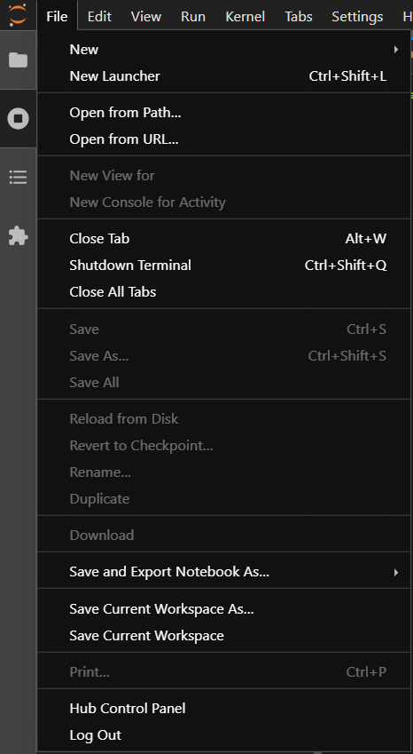

* Enfin cliquez sur le bouton *Stop My Server*. 
  
  

---

# [EN] Running an R script on Marbec-GPU from scratch

In this tutorial, we will see how to run an R script on the HPC Marbec-GPU from (almost) zero. While we will use RStudio Server to edit our script in this example, we will NOT run our code in RStudio. Instead, we will execute it using SLURM commands through a BASH script trough the Terminal of JupyterLab in Marbec-GPU. This is the recommended way to run scripts that require the use of multiple cores/threads or GPUs.

:::{.callout-note}
During this post we will use a lot the term HPC, which stands for “High-Performance Computing device”, which in very simple terms means a very powerful computer whose resources can be used by several users at the same time. For more details about the features of Marbec-GPU and Marbec-DATA, please refer to our post [Marbec-GPU Documentation](/servers.qmd).

:::

## BEFORE YOU START  

### Prerequisites  

* You must have an active account on both Marbec-GPU and Marbec-DATA. If you do not have an account on either of these platforms, please contact the administrators:  
  * Claudia Restrepo-Ortiz ([claudia.restrepo-ortiz@ird.fr](mailto:claudia.restrepo-ortiz@ird.fr))  
  * Nicolas Barrier ([nicolas.barrier@ird.fr](mailto:nicolas.barrier@ird.fr))  

* Install the FileZilla software, which we will use to transfer input and output files between our PC and Marbec-DATA. You can find the steps for downloading, installing, and logging into FileZilla in our post: [Managing files from/to Marbec-DATA](/manualsguides-posts/marbec-data-manage-files/marbec-data-manage-files.qmd).  


### Working Directory  

One of the main recommendations when working with R is to properly define a folder that will contain the input/output files and scripts needed to obtain our results. Having an active account on Marbec-DATA means that there is also a folder named after our username, which Marbec-GPU can access.  

The first step is to create a folder that will serve as our working directory. There are several ways to do this: via the Marbec-DATA web interface, through a JupyterLab terminal window, or by creating an RStudio Server project. Here, we will use the third method, as it allows us to take advantage of managing everything within an RStudio project.  

* Log in to Marbec-GPU via the link [marbec-gpu.ird.fr](https://marbec-gpu.ird.fr/) and select the first server option (i.e., the simplest one).  

* The JupyterLab web interface will appear. Click on the RStudio Server icon. 

  

* A new tab will open with the RStudio Server interface, which is VERY similar to RStudio Desktop, though not exactly the same. Select **File → New Project**.  

  
  
* Choose **New Directory**, then **New Project**, and finally, enter the name of this new project (which will also be the name of our working directory). Click **Create Project** to finalize.  

  

  

  

:::{.callout-warning}  
It is possible that the folder you are working on ALREADY IS or is inside a folder that IS ALREADY available (visible) to Marbec-Data. In that case, the next step is not required since Marbec-GPU will already have access to your folder and any addressing will be done through the BASH script, the creation of which you will see in the next steps of this post.

In other words, the following step is recommended only for those users who do NOT have any folder associated with Marbec-DATA, or who wish to open set up their Working Directory as a new folder in Marbec-DATA.
:::  

* Make our folder visible in Marbec-DATA. This is achieved through a symbolic link. To do this, just go to the Terminal panel in RStudio (it can also be done through a JupyterLab Terminal window) and execute the following command:

```bash
# Here you must replace the values of your_username and your_folder accordingly
cd /home/your_username/ && ln -s /marbec-data/your_folder
```

### Input Files  

Great! Now that we have our working directory, the next logical step is to copy the necessary files into it using FileZilla. You can find the steps for doing that in our post: [Managing files from/to Marbec-DATA](/manualsguides-posts/marbec-data-manage-files/marbec-data-manage-files.qmd).  

:::{.callout-note}  
A good practice is to organize your working directory with subdirectories for different types of files. For example:  
- 📁 **raw** (raw data)  
- 📁 **inputs** (processed input files)  
- 📁 **outputs** (results)  
- 📁 **code** (scripts)  
- 📁 **figures** (plots and images)  
:::  


### Preparing Our R Script  

If you have decided to use Marbec-GPU for your R script, there are two possible scenarios:  

* You have a script that works well on your PC but only uses a single core, and you want to parallelize its execution on Marbec-GPU. If this is your case, we recommend first developing a parallelized version of your script on your PC using minimal resources (e.g., 2 processing cores). Once you have run this script on your PC and ensured that it produces the correct outputs, running it on Marbec-GPU will be very straightforward. If you want to learn how to parallelize a script quickly, you can check out our related post.  

* You already have a script that utilizes multiple cores and works relatively well on your PC, but you cannot run it fully due to limited resources (CPU cores, RAM, or GPU).  

:::{.callout-warning}  
To proceed with the next steps, you must already have a functional parallelized script that you have successfully run on your PC and confirmed to be working correctly.  
:::  

Now, in our RStudio Server web interface, we will open our R script and perform the following checks:  

* Review any references to files (input or output) to avoid possible "File not found" or "Incorrect path" errors. A simple way to do this is to use the **Tab** key (in our keyboard) when typing file paths so that RStudio automatically completes the correct path within our **Working Directory**.  

  

* Verify that all the required packages for our script are installed on Marbec-GPU. This is easy to check by attempting to load each package using the `require` or `library` functions. If a package is missing, we can install it using the `install.packages` function or through the standard method in RStudio, i.e., via **Tools → Install Packages**.  

* Ensure that our R script explicitly saves the desired results. For example, if we generate figures using the **graphics** environment, we must include lines that save these figures (`png`, `jpeg`, `pdf`, and `dev.off`). Similarly, if using **ggplot2**, we need to save the plots accordingly. If our script generates tables, we should store them in CSV, XLSX, or any other format that allows us to read them later. Finally, if the script produces complex objects (e.g., GAM outputs, lists, or special-format objects from specific packages), we can use the `saveRDS` function to store them in a binary format for later retrieval on our PC.  

:::{.callout-note}  
## Special Objects  

Some package-specific objects require special handling when being saved. It is always recommended to check the package documentation and use its provided saving functions. A clear example is the **terra** package, which has its own version of `saveRDS` for its main objects. When saving objects from this package, we should explicitly use `terra::saveRDS`.  
:::  

* If our script generates output files, we must ensure that the subdirectories where these files will be stored i) **already exist** in our **Working Directory** (otherwise they can be created via the Marbec-DATA web interface, FileZilla, or a Terminal using `mkdir subfolder_name/`), or ii) they **will be created within the script**, by adding explicit R commands such as `dir.create`. 

* A **highly recommended** practice is adding commands to print messages that help track the script's progress. Let's clarify it with an example: Imagine our script consists of three main stages—file reading, data analysis, and figure generation. At the end of each stage, we should insert a line of code that prints a message indicating its successful completion (using functions like `print`, `cat`, or `message`). This may not seem crucial when running a script in RStudio since we can always check the Console to see where execution stands. However, when running a script via a BASH command (which we will cover in the next steps), we will not have a user-friendly interface to track execution progress—unless we include explicit print statements, such as `r print("Data reading [OK]")` or `r cat("\nFigure 1 [OK]")`.
    
This way, if an error occurs, it will be much easier to determine where the script successfully executed (i.e., the last printed message) and thus identify where the issue might have originated.  

:::{.callout-note}  
Do not hesitate to add print statements! If your script runs processes inside a loop (i.e., within a `for` or `while` statement), it is advisable to include a print statement just before the loop ends. Example:  

```r
for(j in 1:100){
  # Some interesting process here
  
  cat(sprintf(fmt = "Step %i completed", j))
}
```
:::  

:::{.callout-important}
## DO NOT run from RStudio Server  

While it is possible to run a script from the RStudio Server interface from this point, this IS NOT a good practice due to many reasons:

* Workload and queue management: In Marbec-GPU, computational resources are allocated through a workload queue manager (SLURM), so if you launch a complex script from RStudio Server, it will NOT go through the queue manager, which may cause (i) compute nodes not to be used correctly, (ii) the script to be dropped due to excessive resource consumption, or (iii) other tasks in the system to suffer delays.

* Inefficient use of resources: RStudio Server is NOT designed to deal with intensive computation handling; on the other hand, a script launched with a SLURM BASH can take advantage of the entire cluster infrastructure.

* Stability: RStudio Server is subject to timeouts and session limitations. If your script takes too long, the session could be closed and progress lost. In contrast, scripts executed through the queue manager run safely and in the background, avoiding unexpected interruptions.

Use RStudio Server as an IDE, i.e. to create or edit scripts or to run very basic processes such as getting a list of folders or files, simple arithmetic operations, running the first steps of a script to make sure it is loading files correctly, etc. Any other test that involves a complex computation (e.g. testing a multithreaded loop), it is recommended to do it on your PC BEFORE loading it in Marbec-GPU.

Remember that Marbec-GPU administrators are constantly monitoring resource usage and **any complex script launched from RStudio Server is likely to be terminated**.
:::

### Preparing our BASH Script  

Great! We now have our working directory, input data, and R script ready. It's time to prepare the command that we will send to Marbec-GPU to execute everything via a **BASH script**. But what exactly is a BASH script, and why is it important?  

A **BASH script** is a text file containing a sequence of shell commands that automate tasks in Unix-based systems. In **High-Performance Computing (HPC)** environments using **SLURM (Simple Linux Utility for Resource Management)**, BASH scripts are essential for job scheduling and resource allocation. These scripts typically include **SLURM directives** to define resources such as CPUs, memory, and execution time, followed by commands to load necessary modules and execute programs (e.g., an R/Python script).  

Essentially, a BASH script simply runs our R script (file), but its importance lies in defining the computational resources the HPC will allocate to our process.  

:::{.callout-note}  
For more complex workflows, a BASH script can orchestrate the execution of multiple scripts in different formats (e.g., various programming languages or frameworks). However, for the purposes of this post, we will focus only on running a single R script within a BASH script.  
:::  

Below, we will present a basic R script that runs a parallelized process:  

```{r}
#| eval: false

require(foreach)
require(doParallel)

# Registering cluster
cl <- makeCluster(spec = 3)
registerDoParallel(cl = cl)
requiredPkgs <- c("dplyr")

# Run multithread process
allBoots <- foreach(i = 1:300, .inorder = FALSE, .packages = requiredPkgs) %dopar% {
  # Simulating a process that last 5 seconds
  Sys.sleep(5)
}

# Finish cluster
stopCluster(cl)
```

Let's say that within our working directory, we have saved this script in the path **code/my_script.R**. Now, we will create our BASH script, which we will save directly in the root of our working directory. (By *root*, we mean that this script will NOT be inside any subfolder, unlike our R script). We will name this file **my_script_bash.sh**.  

A BASH file is a plain text file, so we can create it directly from RStudio Server by navigating to **File → New File → Text File**. 

```bash
#!/bin/bash

#SBATCH --ntasks=2
#SBATCH --mem=2G
#SBATCH --cpus-per-task=2
#SBATCH --job-name=my_1st_job
#SBATCH --error=job_%x_%j.err
#SBATCH --output=job_%x_%j.log

cd $SLURM_SUBMIT_DIR
Rscript code/my_script.R
```

Then, we will save it with the specified name (**my_script_bash.sh**). It is important to note that, regardless of the name we choose, it must ALWAYS end with **.sh**, as this extension allows it to be recognized as a BASH script file. 

Let's go through each line of our BASH script:  

* `#!/bin/bash` → Specifies that the script should be executed using the **BASH** shell.  
* `#SBATCH --ntasks=2` → Requests **two tasks** (processes) for the job. This means that two physical cores are allocated for our process.  
* `#SBATCH --mem=2G` → Allocates **2GB of RAM** for the job.  
* `#SBATCH --cpus-per-task=2` → Assigns **2 threads** (i.e., logical processors) to each physical processor.  
* `#SBATCH --job-name=my_1st_job` → Sets the job name to **"my_1st_job"** for easier identification.  
* `#SBATCH --error=job_%x_%j.err` → Redirects **error messages** to a file named **"job_my_1st_job_JOBID.err"** (`%x` = job name, `%j` = job ID).  
* `#SBATCH --output=job_%x_%j.log` → Saves the **job output** (including printed messages) to **"job_my_1st_job_JOBID.log"**. This file will also store any messages explicitly printed in our R script.  
* `cd $SLURM_SUBMIT_DIR` → Changes to the **directory from which the job was submitted**. This line is always important because it ensures that the working directory for our BASH script is the same as the one used by our R script.  
* `Rscript code/my_script.R` → Executes the **R script** (`my_script.R`) located in the **"code/"** folder.  

One key consideration when defining these parameters is that the total number of threads allocated should always be **greater than or equal to** the number of parallel processes defined in our R script. For example, in our R script, we specified `cl <- makeCluster(spec = 3)`, meaning we are using 3 parallel threads. Therefore, in our BASH script, the product of `ntasks` and `cpus-per-task` must be at least **3**, which in this case is correct.  

:::{.callout-note}  
## `cpus-per-task`  

At the time of writing this guide, Marbec-GPU uses Intel processors that support **Hyperthreading**, allowing **two logical processors (threads) per physical core**. However, newer processors can support more than two threads per core, so this information will always depend on the currently installed hardware.  
::: 

:::{.callout-warning}  
## Reserved Resources and Resource Limits

We have said that, in simple terms, Marbec-GPU is like a very powerful computer, but it is NOT infinitely powerful. Moreover, the use of computing power is shared with different users, so it is the responsibility of each of us to choose the available resources appropriately.

It is therefore advisable that any script that we are going to run in Marbec-GPU has been previously tested in our PCs, not only in order to verify that everything works correctly, but also to evaluate how many resources our script consumes under certain conditions and then use these values to define the parameters that will be reserved to run our process in Marbec-GPU. For example, if on our PC, our script uses 20 GB of RAM at 8 processing threads, then, when scaling to 16 threads on Marbec-GPU, we can set a value ~40 GB of RAM (using the `mem` parameter). While this calculation is approximate, it is better to underestimate what we need than to overestimate and end up reserving more resources than we will actually use. Again, Marbec-GPU is a shared tool and, if we, for example, reserve 80 GB while our script only needs 40 GB, although we will not get any errors, that computational capacity will NOT be available to other users, which will result in long usage queues or simply denials for those other users.

Let's be responsible.
::: 

### Running Our BASH Script  

Once our BASH script is ready, the final step is to execute it in a Terminal window. While we could use the *Terminal* tab in RStudio Server, for clarity and productivity, we will use the Terminal provided by the JupyterLab interface.  

1. Open JupyterLab in your browser by going to [marbec-gpu.ird.fr](https://marbec-gpu.ird.fr/).
2. Select the *Terminal* icon.
  
  
  
3. A classic black Terminal screen will open, displaying `yourusername@marbec-gpu:~$` with a blinking cursor.  

  

At this point, the Terminal is in your **home directory**, so you need to navigate to your project folder using the `cd` command. If your project folder is named **My_1st_project**, enter:  

```bash
cd MyFirstProj
```  

Then, to ensure you're in the correct location, run:  

```bash
ls
```  


This command should list your **BASH script** and the `code/` subfolder where your R script is stored. To verify further, you can check the contents of `code/` with:  

```bash
ls code/
```  


:::{.callout-tip}
As in RStudio, in JupyterLab's Terminal it is possible to use the Tab key to complete text of commands or paths to directories or files. If there is more than one element that begins with the hint we are giving it, the autocomplete will stop until the part in common, so we will have to type some more characters to give a hint to the autocomplete.
:::


## DURING EXECUTION  

Let's quickly review what we should have prepared:  

* A **working directory** (project folder).  
* An **R script**, preferably inside a subfolder named `code/`.  
* **Input data** files, ideally organized into subfolders (`raw/`, `inputs/environmental/sst/`, `inputs/records/`, etc.).  
* **Subfolders** for storing output files (figures, tables, R objects, etc.).  
* **Required R packages installed**, as well as any additional software (e.g., CUDA, Gurobi, etc.).  
* A **BASH script** stored in the root folder.  

Once everything is ready:  

1. Open **JupyterLab** and Open a **Terminal** window by selecting the corresponding icon.
2. Ensure you are inside your project's root folder (`cd` and `ls` commands help with this). 
3. Run your BASH script with:  

```bash
sbatch my_script_bash.sh
```  

If everything is set up correctly (i.e., there are no syntax errors in your BASH script), the first thing you will see is a message displaying the **Job-ID** assigned to your process. 


Additionally, if you run `ls`, you should see two newly created files:  

* **`job_<NameOfJob>_<jobID>.log`** → Stores printed messages from our R script.
* **`job_<NameOfJob>_<jobID>.err`** → Logs any errors or warnings encountered during execution.


### Monitoring Execution Progress  

While the script is running, we can monitor its progress in different ways:  

* Checking the `.log` and `.err` Files: Since these files store script messages, we can open them using RStudio Server at any time to track execution progress.  

:::{.callout-tip}  
## The `watch` and `tail` Commands  

To continuously monitor the last **15 lines** of the `.log` file, updating every **10 seconds**, use:  

```bash
watch -n 10 tail -n 15 job_my_1st_job_9999.log
```  

Replace `9999` with the actual **Job-ID**, which you can find by running `bash squeue`.

This method is extremely useful, especially if our R script prints relevant progress messages.  

To **exit this monitoring mode** and return to the regular Terminal, press `Ctrl + C` (Windows/Linux) or `Cmd + C` (MacOS).
:::  

* Checking the Job Status with `squeue`  

Through the `squeue` command it is possible to monitor the status of our process as well as check how long it has been running. The result of running `squeue` in Terminal may look like this:


The `ST` column shows the status of the process, while the `NODELIST(REASON)` column gives details of that status. In the image above you can see the three most common values that will be shown in the `NODELIST(REASON)` column:

* `marbec-gpu`: Indicates that our process is already running. In the `TIME` column we can visualize the time that process has been running in the format **DAYS-HOURS:MINUTES:SECONDS**. It is important to point out that the `spawner-Jupyterhub` process refers to our own session in Marbec-GPU.

* `(Priority)`: One or more higher priority jobs is in queue for running. Your job will eventually run.

* `(Resources)`: The job is waiting for resources to become available and will eventually run.

If you want to know more details about the possible states, we recommend you to visit this post: [`squeue` Status and Reason Codes](https://curc.readthedocs.io/en/latest/running-jobs/squeue-status-codes.html#squeue-status-and-reason-codes).

:::{.callout-tip}  
## See complete details

By default, the result of the `squeue` table shows trimmed results. If you want to see more details, you will have to indicate it through the `--format` argument. For example:

```bash
squeue --format="%.18i %.9P %.30j %.8u %.8T %.10M %.9l %.6D %R"
```

Although it may seem complicated, the syntax is quite simple. There are several pieces in the form `%.[X][Y]`, where the letter in the `[Y]` position is used to indicate the column over which you want to change the text length, while the number in the `[X]` position is used to indicate the number of characters you want to display for that column.
:::

* Checking Output Files  

We can also track progress by inspecting the output files generated in our subdirectories. This can be done using (i) the **web interface of Marbec-DATA**, (ii) **FileZilla**, or (iii) the **JupyterLab Terminal** with the command `bash ls our/subdirectory/`.

* Checking using of resources

Monitoring the resource usage of our process is important because we can avoid problems such as exceeding allocated storage limits, or inefficient use of resources (e.g., reserving more resources than our process actually uses). One of the most visual ways to perform this monitoring is by using the `htop` command as follows:

```bash
htop --user <username> --pid <jobID>

# Example
htop --user mcurie --pid 7145
```

It is recommended to monitor at least in the first few minutes or when we know that our process is running fully. To exit `htop` mode, just press the `F10` key or the key combination `Ctrl+C` (Windows/Linux) or `Cmd+C` (MacOS).

::: {.callout-tip}
## Leave everything running and don't worry about it

Two of the great advantages of using Marbec-GPU are:

* Being able to leave our code running and not needing to leave our PC on. This is something that our PC will thank us for, since laptops are often not designed to run intense computing tasks for long periods of time (hours or days), and forcing them to do so can lead to hardware failures (RAMs or fonts that burn out) that are often irreversible.

* Being able to monitor the progress of our process from anywhere where we have an internet connection and a web browser, i.e., even from our smartphone!

:::


## AFTER EXECUTION  

To verify that the process has finished, we can run `bash squeue`. If the Job-ID is no longer listed, the execution is complete. Next, we should:  

* Check the **.log** and **.err** files to evaluate whether everything ran smoothly or if any errors occurred. These are plain text files and can be opened directly in RStudio Server (**File → Open File**).

* Use RStudio Server to **quickly inspect** output files, but keep in mind that this session runs with limited RAM. If the output files are too large, it's better to copy them to your PC and analyze them locally.  

* If everything went well, **transfer the output files to your PC** using **FileZilla**. You can find detailed steps in our post: [Managing files from/to Marbec-DATA](/manualsguides-posts/marbec-data-manage-files/marbec-data-manage-files.qmd). 

If you do not plan to run a process again, a VERY important final step is to log out of Marbec-GPU, thus allowing access to other users who may be waiting for resources. To do this, you must: 

* Go to the JupyterLab interface and select the menu option *File → Hub Control Panel*.

  

* Finally click on the *Stop My Server* button. 

  
 