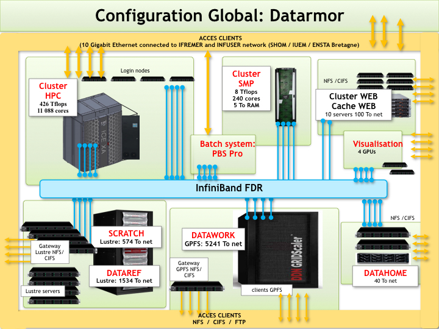

Image credits: Diego Fernandez at [Unplash](https://unsplash.com/photos/mixing-console-yRNJAcdpDAo?utm_content=creditShareLink&utm_medium=referral&utm_source=unsplash)

# [FR] Serveurs

## Serveurs des Applications Web

## Serveurs de Calcul et de Stockage

### Datarmor

Datarmor est un cluster de calcul haute performance (HPC) exploité par l'Ifremer (Institut Français de Recherche pour l'Exploitation de la Mer). Conçu pour la recherche océanographique et marine, il offre des ressources de calcul puissantes pour traiter de vastes ensembles de données et exécuter des simulations complexes. Datarmor soutient des études en modélisation climatique, biodiversité marine et circulation océanique, contribuant ainsi au leadership de la France en science maritime et en innovation HPC.

Site officiel : [pcdm.ifremer.fr](https://pcdm.ifremer.fr/Equipement)

Caractéristiques :

* Cluster HPC : 11088 coeurs - 426 Tflops
* 128 Go de RAM et 28 coeurs par noeud
* Cluster SMP : 240 coeurs, 5 To RAM
* Cluster WEB : 10 serveurs dédiés
* 4 GPUs

### `marbec-gpu` & `marbec-data`

`marbec-gpu` s'agit d'un cluster conçu pour fournir des ressources informatiques de haute performance pour l'exécution de codes, tels que ceux utilisant Python et R. Il est construit sur le noyau Linux-Ubuntu et dispose d'une interface Jupyter pour faciliter l'utilisation. Plusieurs outils courants sont installés, notamment Python, R, Git, Conda, CUDA et RStudio.

`marbec-data` et `marbec-gpu` composent un système de calcul à haute performance. (Très) Fondamentalement, c'est comme avoir un superordinateur préparé pour traiter des problèmes complexes. Imaginez qu'au lieu d'avoir un seul processeur (Intel/AMD) travaillant en conjonction avec la mémoire vive et l'espace de stockage de votre ordinateur (par exemple, votre ordinateur portable), vous avez plusieurs ordinateurs reliés entre eux et combinant leur puissance pour exécuter des processus complexes. C'est ainsi que fonctionne le HPC : il utilise plusieurs ordinateurs qui travaillent ensemble pour résoudre de très gros calculs beaucoup plus rapidement qu'un seul ordinateur personnel ne pourrait le faire. Marbec HPC est composé de deux systèmes : `marbec-data` (un système de fichiers réseau ou NFS) et `marbec-gpu` (une grappe de calcul).

Un NFS est un protocole réseau qui permet à plusieurs appareils connectés à un réseau de partager des fichiers et des répertoires. Cela permet aux chercheurs de stocker les données d'entrée, les codes et les résultats, mais avec l'avantage d'avoir une sauvegarde centralisée et la possibilité d'accéder à leurs fichiers à partir de n'importe quelle machine connectée au cluster. En termes très simples et pour revenir à l'analogie avec votre PC actuel, les « données Marbec » remplacent le stockage (c'est-à-dire le disque dur) dans le HPC. D'autre part, une grappe de calcul est, par essence, un ensemble d'éléments de calcul interconnectés travaillant de manière coordonnée pour exécuter des processus de calcul complexes. Dans l'analogie de votre PC actuel, `marbec-gpu` équivaut à : votre processeur principal (CPU), votre processeur graphique (GPU), la mémoire vive générale et la mémoire vive vidéo. Bien sûr, avec ces simplifications, nous laissons de côté certains détails importants que nous expliquerons en profondeur si nécessaire.

Caractéristiques : 

* 3 GPU : [NVIDIA A40](https://www.nvidia.com/fr-fr/data-center/a40/)
* 2 CPUs : [Intel Xeon Platinum 8380](https://www.intel.com/content/www/us/en/products/sku/212287/intel-xeon-platinum-8380-processor-60m-cache-2-30-ghz/specifications.html) @ 2.30 GHz, 40 cœurs chacun avec Multithreading (i.e. 80 threads).
* 1,48 To de RAM
* Interconnexions `marbec-data`.

Sur ce site web, vous pouvez trouver des articles sur la façon d'utiliser correctement `marbec-gpu` et `marbec-data`, jetez un coup d'oeil à la section [Manuals and Guides]().

## FAQ

* De quelles ressources ai-je besoin d’allouer ?

  Bonne question ! Cela dépend de vos données d’entrée (taille et type), de votre modèle (stochastique, statistique, réseau de neurones, etc.), de votre tâche, mais surtout des packages utilisés. Par exemple, certains packages ne permettent pas d’effectuer des calculs sur GPU, tandis que d’autres ne peuvent pas paralléliser sur plusieurs CPU. Informez-vous donc sur les packages afin d’éviter d’allouer des ressources inutilisées et adaptez vos scripts en conséquence. Quelques exemples d’allocation :

  - **Entraînement Pytorch YOLO** : `--mem=64G`, `--c=16` et `--gres=gpu:1`
  - **Exécution HSMC (TensorFlow)** : `--mem=64GB`, `--cpus-per-task=30` et `--gpus-per-node=1`

* Mon script est-il compatible avec un GPU ?

  Non, pas directement. Cependant, certaines bibliothèques sont compatibles avec les GPU. Si votre framework ou script n’utilise pas spécifiquement le GPU, votre code NE tirera PAS parti du matériel GPU. Principaux exemples de bibliothèques compatibles avec les GPU : PyTorch, TensorFlow, Keras, Theano, Caffe, etc.

* Comment accéder à la file d’attente des jobs ?

  Utilisez la commande suivante : `squeue --user username`.  
  Cette commande affiche une liste détaillée des jobs en attente, y compris le nom du job (par exemple, `spawner-jupyterhub`, qui désigne un “session-job”), le nom d’utilisateur, le temps d’exécution, le nom du nœud (par exemple, `gres:gpu:1` pour une allocation GPU, `gres:gpu:0` pour une allocation CPU), l’état du job (par exemple, `PENDING` pour les jobs en attente de démarrage en raison de la disponibilité des ressources ou de la planification, ou `RUNNING` pour les jobs en cours d’exécution) et `JOBID` (un identifiant unique pour chaque job). Consultez la [documentation SLURM squeue](https://slurm.schedmd.com/squeue.html) pour plus de détails.

* Comment annuler un job soumis ?

  Utilisez la commande `scancel JOBID`, où `JOBID` est l’identifiant du job que vous souhaitez annuler. Vous pouvez trouver l’ID du job en utilisant la commande `squeue`. Pour plus de détails, consultez la [documentation SLURM scancel](https://slurm.schedmd.com/scancel.html).

* Comment soumettre plusieurs jobs sans bloquer les autres utilisateurs ?

  Toute la communauté `marbec-gpu` vous remercie pour votre démarche coopérative et amicale.  
  Vous pouvez utiliser le paramètre `#SBATCH --dependency=afterany:JOBID`, où `JOBID` est l’identifiant du job que vous souhaitez attendre (par exemple, 4391). Vous pouvez trouver l’ID du job dans la sortie de la commande `sbatch` lorsque vous soumettez un job ou en utilisant la commande `squeue`, comme mentionné dans la question précédente. Selon la [documentation SLURM sbatch](https://slurm.schedmd.com/sbatch.html), ce paramètre garantit que le démarrage de votre job est différé jusqu’à ce que la dépendance spécifiée soit satisfaite. Pour des dépendances basées sur des fichiers ou des cas plus complexes, vous pouvez explorer d’autres mécanismes pour retarder ou séquencer l’exécution de votre job selon vos besoins.

---

# [EN] Servers

## Applications' Servers

## Calculation and Storage Servers

### Datarmor

Datarmor is a high-performance computing (HPC) cluster operated by Ifremer (French Research Institute for the Exploitation of the Sea). Designed for oceanographic and marine research, it provides powerful computational resources to process large datasets and run complex simulations. Datarmor supports studies in climate modeling, marine biodiversity, and ocean circulation, contributing to France’s leadership in maritime science and HPC innovation.

Official web site: [pcdm.ifremer.fr](https://pcdm.ifremer.fr/Equipement)

Features :

* CPUs: 11088 cores - 426 Tflops
* 128 GB RAM et 28 cores per node
* Cluster SMP : 240 cores, 5 TB RAM
* Cluster WEB : 10 dedicated servers
* 4 GPUs

### `marbec-gpu` & `marbec-data`

`marbec-gpu` is a cluster is designed to provide high-performance computing resources for code execution, such as those using Python and R. It is built on the Linux-Ubuntu kernel and features a Jupyter interface for ease of use. Several common tools are installed, including Python, R, Git, Conda, CUDA, and RStudio.

`marbec-data` and `marbec-gpu` compose a High-performance computing system. (Very) Basically, it is like having a supercomputer prepared to deal with complex problems. Imagine that, instead of having a single processor (Intel/AMD) working in conjunction with the RAM and storage space of just your computer (e.g. your laptop), you have several computers linked together combining their power to run complex processes. This is how HPC works: it uses multiple computers working together to solve very large computations much faster than a single personal computer could. Marbec HPC is composed of two systems: `marbec-data` (a Network File System or NFS) and `marbec-gpu` (a compute cluster).

An NFS is a network protocol that allows multiple devices connected to a network to share files and directories. This allows researchers to store input data, codes and results, but with the advantage of having a centralized backup and the ability to access their files from any machine connected to the cluster. In very simple words and going back to the analogy with your current PC, `marbec-data` takes the place of the storage (i.e. the hard disk) in the HPC. On the other hand, a compute cluster is, in essence, a set of interconnected computational elements working in a coordinated manner to execute complex computational processes. Within the analogy of your current PC, `marbec-gpu` equates to: your main processor (CPU), your graphics processor (GPU), general RAM and video RAM. Of course, with these simplifications we are leaving out some important details that we will explain in depth as we need to.

Features: 

* 3 GPUs: [NVIDIA A40](https://www.nvidia.com/fr-fr/data-center/a40/)
* 2 CPUs: [Intel Xeon Platinum 8380](https://www.intel.com/content/www/us/en/products/sku/212287/intel-xeon-platinum-8380-processor-60m-cache-2-30-ghz/specifications.html) @ 2.30 GHz, 40 cores each with Multithreading (i.e. 80 threads).
* 1,48 To de RAM
* `marbec-data` Interconnections

In this web site you can find posts about how to correctly use `marbec-gpu` and `marbec-data`, take a look at the [Manuals and Guides]() section.

## FAQ

* What resources do I need to allocate?

  Good question! It depends on your input data (size and type), your model (stochastic, statistical, neural network, etc.), your task, but most importantly, the packages used. For example, some packages do not allow computations on a GPU, while others cannot parallelize across multiple CPUs. Therefore, research the packages to avoid allocating resources that won't be used and adjust your scripts accordingly. Some examples of allocation:

  - **Training Pytorch YOLO**: `--mem=64G`, `--c=16`, and `--gres=gpu:1`
  - **Running HSMC (TensorFlow)**: `--mem=64GB`, `--cpus-per-task=30`, and `--gpus-per-node=1`

* Is my script GPU-compatible?

  No, not directly. However, some libraries are GPU-compatible. If your framework or script does not specifically use the GPU, your code WILL NOT take advantage of the GPU hardware. Major examples of GPU-compatible libraries: PyTorch, TensorFlow, Keras, Theano, Caffe, etc.

* How do I access the job queue?

  Use the following command: `squeue --user username`. This command displays a detailed list of pending jobs, including the job name (e.g., `spawner-jupyterhub` which refers to a "session job"), the username, execution time, node name (e.g., `gres:gpu:1` for a GPU allocation, `gres:gpu:0` for a CPU allocation), job status (e.g., `PENDING` for jobs waiting to start due to resource availability or scheduling, or `RUNNING` for jobs currently executing), and `JOBID` (a unique identifier for each job). Refer to the [SLURM squeue documentation](https://slurm.schedmd.com/squeue.html) for more details.

* How do I cancel a submitted job?

  Use the command `scancel JOBID`, where `JOBID` is the identifier of the job you want to cancel. You can find the Job-ID by using the `squeue` command. For more details, see the [SLURM scancel documentation](https://slurm.schedmd.com/scancel.html).

* How do I submit multiple jobs without blocking other users?

  The entire `marbec-gpu` community thanks you for your cooperative and friendly approach. You can use the parameter `#SBATCH --dependency=afterany:JOBID`, where `JOBID` is the identifier of the job you want to wait for (e.g., 4391). You can find the job ID in the output of the `sbatch` command when submitting a job or by using the `squeue` command, as mentioned in the previous question. According to the [SLURM sbatch documentation](https://slurm.schedmd.com/sbatch.html), this parameter ensures that your job's start is delayed until the specified dependency is satisfied. For file-based dependencies or more complex cases, you can explore other mechanisms to delay or sequence your job execution according to your needs.

